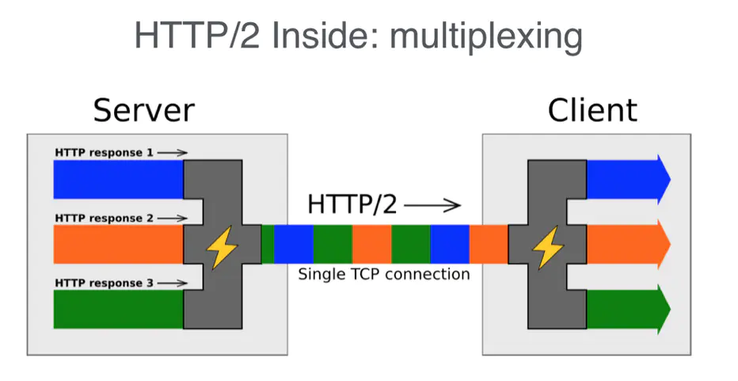
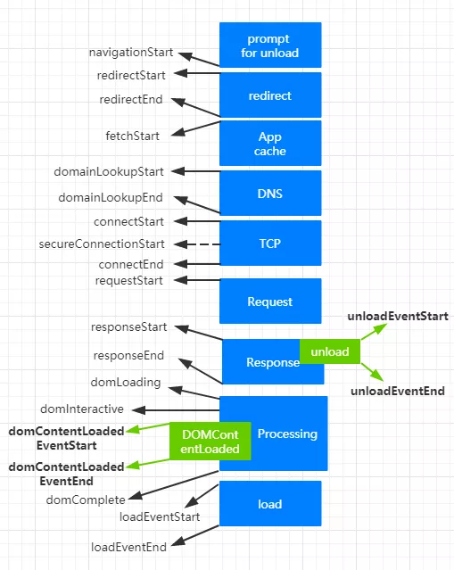
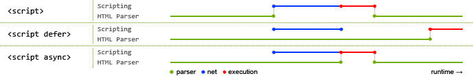

[css](#css)
- [选择器](#选择器)? TODO:
- [css定位背景图片](#css定位背景图片)
- [transform](#transform)?TODO:
- [重绘和回流](#重绘和回流)
- [flex布局](#flex布局)?TODO:
- [垂直水平居中](#垂直水平居中)
- [元素透明](#元素透明)
- [清除浮动](#清除浮动)?TODO:
- [伪类和伪元素](#伪类和伪元素)
- [盒模型](#盒模型)

[浏览器](#浏览器)
- [302和304](#302和304)
- [各种攻击](#各种攻击)
	- [XSS](#XSS)
	- [CSRF](#CSRF) 
- [cookie和sessionk](#cookie和session)
- [输入url到看到页面都经历了啥](#输入url到看到页面都经历了啥) TODO: js和css的加载顺序
- [https](#https)
	- [http的缺点](#http的缺点)
	- [https的优势和关键点](#https的优势和关键点)
- [http2.0](#http2.0)?
 - [http1.0缺点](#http1.0缺点)
 - [多路复用MultiPlexing](#多路复用MultiPlexing)
 - [头部header压缩](#头部header压缩)
 - [服务端推送ServerPush](#服务端推送ServerPush)
 - [http3](#http3)
- [CDN](#CDN) TODO:
- [DOMContentLoaded和load事件](#DOMContentLoaded和load事件)
- [jwt](#jwt) TODO:
- [首屏优化方案](#首屏优化方案)
	- [减少组件库](#减少组件库)
	- [动态路由拆分codeSplitting](#动态路由拆分codeSplitting)TODO: 总结一下，考的几率不大
	- [preload](#preload)
	- [prefetch](#prefetch)
	- [Prerendering](#Prerendering)
	- [preconnect](#preconnect)
	- [async&&defer](#async&&defer)
	- [图片懒加载](#图片懒加载)
	- [SSR](#SSR)
	- [ServiceWOrker缓存](#ServiceWOrker缓存)

[webpack](#webpack)TODO:
- [codingSplitting]

[Commen](#Commen)
- [如何理解mvvm](#如何理解mvvm) 
	- [View层](#View层)
	- [Model层](#Model层)
	- [ViewModel层](#ViewModel层)
	- [数据绑定](#数据绑定)
- [refs在vue和react里面的使用](#refs在vue和react里面的使用) ?TODO:
- [vue和React的相同点](#vue和React的相同点)
- [vue和React里面的key](#vue和React里面的key)
- [vue和react的diff算法](#vue和react的diff算法) ?TODO:
- [路由hash和history](#路由hash和history)
	- [hash](#hash) 
	- [hashRouterHandler的实现](#hashRouterHandler的实现)  
	- [history](#history) 

[Vue](#Vue)
- [生命周期](#生命周期)
- [如何实现双向绑定](#如何实现双向绑定)
- [keepAlive](#keepAlive)
- [SPA&&SEO&&SSR](#SPA&&SEO&&SSR)
	- [SPA](#SPA) 
	- [SEO](#SEO) 
	- [SSR](#SSR) 
- [window.performance](#window.performance) 
	- [performance.memory](#performance.memory)
	- [performance.navigation](#performance.navigation)
	- [performance.timing](#performance.timing)
- [vue数据劫持](#vue数据劫持)
 - [Object.defineProperty](#Object.defineProperty)
 - [Proxy](#Proxy)

[React](#React)TODO:
- [生命周期](#生命周期)?
- [class和function](#class和function)?
	- [优缺点](#优缺点)
	- [使用场景](#使用场景)
	- [mobx和redux](#mobx和redux) ?
	
[小程序相关](#小程序相关)TODO:
- [小程序生命周期](#小程序生命周期)
- [mpvue生命周期](#mpvue生命周期)
- [uniapp生命周期](#uniapp生命周)
- [taro生命周期](#taro生命周期)
- [如何实现0.5px](#如何实现0.5px)
- [rem和px的转换](#rem和px的转换)
- [小程序的适配问题](#小程序的适配问题)

[js](#JS)
- [栈和堆](#栈和堆)
- [基本数据类型](#基本数据类型)
- [引用数据类型](#引用数据类型)
- [数组方法汇总](#数组方法汇总)
- [什么是类数组 类数组如何变成数组](#类数组)
- [变量提升](#变量提升)
	- [LexicalEnvironmet](#LexicalEnvironmet)
	- [var](#var)          
	- [函数](#函数)
	- [let&const](#let&const)
	- [TDZ(tempral dead zoon)](#TDZ)
- [继承](#继承)
	- [__proto__和prototype](#__proto__和prototype)
	- [原型对象上函数内部this指向问题](#原型对象上函数内部this指向问题)
	- [组合式继承](#组合式继承)
	- [组合寄生式继承](#组合寄生式继承)
	- [class继承](#class继承)
- [如何判断数据类型](#如何判断数据类型)
	- [instanceOf](#instanceOf)
	- [如何实现instanceOf](#如何实现instanceOf)
	- [typeOf](#typeOf)
	- [判断两者是否相等](#判断两者是否相等)
	- [toString](#toString)
	- [undefined与null](#undefined与null)
	- [如何判断一个数据类型是普通对象](#如何判断一个数据类型是普通对象)
- [如何理解闭包](#如何理解闭包)
- [Js垃圾回收机制](#Js垃圾回收机制)
 - [标记清除](#标记清除)
 - [引用计数](#引用计数)
 - [总结](#总结)
- [缓存相关](#缓存相关)
	- [强制缓存](#强制缓存)
	- [协商缓存](#协商缓存)
	- [ServiceWorker](#ServiceWorker)
	- [memoryCache](#memoryCache)
	- [diskCache](#diskCache)
	- [networkRequest](#302和304)
- [EventLoop运行机制](#EventLoop运行机制)
	- [浏览器进程与线程](#浏览器进程与线程)
	- [macrotask和microtask](#macrotask和microtask)
	- [总结事件执行机制](#总结事件执行机制) TODO: 检查到这里
- [事件](#事件) TODO:
	- [冒泡和捕获](#冒泡和捕获)
	- [addEventListenerVSonload](#addEventListenerVSonload)
	- [如何实现一个事件的发布订阅](#如何实现一个事件的发布订阅)
- [foreach&&forIn&&forOf](#foreach&&forIn&&forOf)
	- [foreach](#foreach)
	- [for...in](#for...in)
	- [for...of](#for...of)
- [深拷贝和浅拷贝](#深拷贝和浅拷贝)
	- [浅拷贝](#浅拷贝)
	- [深拷贝](#深拷贝)
	- [Object.assign()](#Object.assign())
	- [Object.create()](#Object.create())
	- [new的简单实现](#new的简单实现)
	- [new和Object.create()不同](#new和Object.create()不同)
	- [寄生组合继承与Object.create()的关系](#寄生组合继承与Object.create()的关系)
	- [Map和WeakMap](#Map和WeakMap)
- [DOCTYPE的作用](#DOCTYPE的作用)
- [call-apply-bind区别&&实现](#call-apply-bind区别&&实现) TOSEE
- [promise的理解实现](#promise的理解实现) TOSEE
	- [异步相关概念和代码执行顺序](#异步相关概念和代码执行顺序)
	- [概念和用法](#概念和用法)
	- [实现](#实现)
	- [async/await](#async/await) ?
	- [generator](#generator)?
- [函数的节流和去抖](#函数的节流和去抖)
- [跨域概念及其实现](#跨域概念及其实现)?
- [class的理解和使用](#class的理解和使用)
	- [基本用法](#基本用法)
	- [class继承](#class继承)
	- [class的this指向问题](#class的this指向问题)
	- [class实现](#class实现)
- [箭头函数和普通函数](#箭头函数和普通函数)
- [buffer&&stream](#buffer&&stream)?
- [函数式编程](#函数式编程)
	- [函数柯里化](#函数柯里化)
	- [什么是高阶函数](#什么是高阶函数)
	- [高阶函数与高阶组件](#高阶函数与高阶组件)
- [location.href](#location.href)?
- [es6-es10新特性](#es6-es10新特性)?
- [importVSrequier](#importVSrequier)
- [JS中浮点数精度问题](#JS中浮点数精度问题)
- [window.onload](#window.onload)?
- [express和koa中间件的使用不同之处](#express和koa中间件的使用不同之处)?

[算法](#算法)TODO:
- [时间复杂度和空间复杂度]
- [异步求和]
- [大位数加减乘除]
- [链表]
- [排序]
- [最长公用首字符串](#最长公用首字符串)

### CSS
-----------------------------------------------
- ### 选择器
	:nth-last-child(n) 
	:nth-of-type(n) 
	:nth-last-of-type(n) 
	:last-child 
	:first-of-type 
	:only-child 
	:only-of-type 
	:empty 
	:checked 
	:enabled 
	:disabled 
	::selection 
	:not(s)
- ### css背景图片相关
	- #### background-clipbackground-clip:
	> 规定背景的绘制区域 - backround-origin: 规定背景图片的定位区域
- ### transform
	> : translate(150px, 100px);
- ### 重绘和回流
	> reflow:当render树中的一部分或者全部因为大小边距等问题发生改变而需要重建的过程叫做回流, 就是当一些物理部分改变的时候，包括margin,padding,height,width,border等
	> repaint:当元素的一部分属性发生变化，如外观背景色不会引起布局变化而需要重新渲染的过程叫做重绘 就是一些修饰的属性改变的时候，比如颜色。 `回流一定会伴随着重绘，但是重绘不一定会引起回流。回流的代价比重绘高。`

- ### flex布局
> flex属性是flex-grow, flex-shrink 和 flex-basis的简写，默认值为0 1 auto
- flex-grow: 默认为0，即如果存在剩余空间，也不放大
- flex-shrink: 定义了项目的缩小比例，默认为1，即如果空间不足，该项目将缩小,0就不缩小
- flex-basis：它可以设为跟width或height属性一样的值（比如350px），则项目将占据固定空间。auto表示项目本来大小

- ### 垂直水平居中

- ### float和inline的区别和联系

- ### 元素透明
	- overflow:hidden/* 占据空间，无法点击 */
	- opacity:0/* 占据空间，可以点击 */
	- visibility:hidden/* 占据空间，无法点击 */
	- display:none
	- position:absolute/* left top 设置的非常远 */
	- z-index:-1000/* 不占据空间，无法点击 */
	
- ### 清除浮动

- ### 伪类和伪元素：
> 伪类本质上是为了弥补常规CSS选择器的不足，以便获取到更多信息, 伪元素本质上是创建了一个有内容的虚拟容器；
```css
	q:lang(de)::after{
			content: " (German) ";
	}
	/* 伪元素：::before  ::after */
	/* 伪类：:active		:focus :hover		:link :visited	:first-child
			:lang :nth-child(odd) :nth-child(even) */
```
- ### 盒模型
> magin+border+padding+content(width), 但实际盒子的大小没有margin，加上margin是指占地面积
- W3C: 属性width,height只包含内容content，不包含border和padding。
- IE: 属性width,height包含border和padding，指的是content+padding+border
> 若在页面中声明了`DOCTYPE`类型，所有的浏览器都会把盒模型解释为W3C盒模型  
> IE8+ 可以支持box-sizing
- box-sizing: content-box(default)
- box-sizing: border-box border算在width里面
- box-sizing: inherit

## JS
-----------------------------------------------
- ### 栈和堆
> 栈是先进后出，用来存储基本类型
> 引用数据类型存储在堆内存(树状结构)中,引用数据类型在栈中存储了指针，该指针指向堆中该实体的起始地址
> 闭包中的变量并不保存中栈内存中，而是保存在堆内存中。 这也就解释了函数调用之后之后为什么闭包还能引用到函数内的变量。

- ### 基本数据类型
> undefined，boolean，number，string，null，symbol，放在栈里，数据大小确定，内存空间大小可以分配，是直接按值存放的，所以可以直接访问 `基本类型的比较是值的比较`
> `symbol`: 每个从Symbol()返回的symbol值都是`唯一`的

- ### 引用数据类型
> 对象、数组、函数、类数组、正则啥的 指针在栈中但是值在堆中 console.log({} == {}); // false `引用类型的比较是引用的比较`

- ### 数组方法汇总
 > 会改变原数组： reverse() sort() splice() pop() push() shift() unshifit()
 > 高阶：sort(), map(), forEach()
	```javascript
		`push() && pop()`
		`push在数组末尾添加一个元素，返回数组的长度, pop删除数组末尾一个元素，返回该元素`
		const arr = [1,3,5]
		const pushArrLen = a.push(7) // arr = [1,3,5,7]  pushArrLen = 4
		const arr = [1,3,5]
		const popArrLen = a.pop() // arr = [1,3]  popArrLen = 5

		`unshift() && shift()`
		`unshift在数组开头添加一个元素，返回数组的长度, shift删除数组第一个元素,返回该元素`
		const arr = [1,3,5]
		const unshiftArrLen = arr.unshift(7) // arr = [7,1,3,5]  unshiftArrLen = 4
		const arr = [1,3,5]
		const shiftArrLen = a.pop() // arr = [3,5]  shiftArrLen = 1

		`slice(start, end) `
		`接收两个参数，start < end，返回 [start, end) 区间之间的元素数组，不改变原数组`
		`可以接收负数作为参数， -1 为倒数第一个元素，-2 为倒数第二个元素，依此类推`
		const arr = [1, 2, 3, 4, 5, 6, 7, 8]
		const sliceArr = arr.slice(3, 5) // sliceArr = [4, 5]

		`splice(index, howmany, item1, item2...itemx)`1
		`方法向/从数组中添加/删除项目，然后返回被删除的项目。该方法会改变原始数组。`
		const arr = [1, 2, 3, 4, 5]
		const spliceArr = arr.splice(2, 3, 6, 7, 8) // arr = [1, 2, 6, 7, 8]  spliceArr = [3, 4, 5]

		`includes()`
		`es7`
		const arr = [1, 2, 3, 4, 5]
		const includeNum4 = arr.includes(4)
		const includeNum7 = arr.includes(7)
		// includeNum4 = true  includeNum7 = false

		`concat()`
		`方法在一个数组后面拼接新的元素，可接收 n 个参数，参数可以是任意数据类型，如果是数组，则将数组跟原数组拼接，如果是其他数据类型，则将该元素添加到原数组后面 该方法不改变原数组，会返回拼接好的新数组，因此可以 执行 链式操作`
		const arr = [1,3,5]
		const concatArr = arr.concat(2,4).concat(6,7,8).concat('hello world').concat(() => {}, [9,10,[11,12]])
		=> arr = [1,3,5]
			concatArr = [1, 3, 5, 2, 4, 6, 7, 8, 'hello world', () => {}, 9, 10, [11, 12]]

		`reverse`
		`方法将一个数组倒置，该方法返回新的数组，且会改变原数组`
		const arr = [1, 2, 3, 4]
		const reverseArr = arr.reverse() // arr = [4, 3, 2, 1]  reverseArr = [4, 3, 2, 1]

		`forEach()`
		`这是最常用的用来遍历数组的方法，需要注意的是该方法不会改变原数组，而且没有返回值。`
		const arr = [1,3,4,5,6,8]
		arr.forEachI(item => {
			console.log(item)
		})
		// 1,3,4,5,6,8

		`filter()`
		`该方法顾名思义，这个方法是用来过滤的，该方法返回一个每一项都符合条件的新数组，不改变原数组`
		const arr = [1,5,3,22,6]
		const filterItem = arr.filter(item => item % 2 === 0) // filterItem = [22,6]

		`every()`
		`接收一个函数作为参数，判断数组中每一项都是否满足条件，只有所有项都满足条件，才会返回true。`
		const arr = [1,5,2,4,11]
		const isBig = arr.every(item => item > 5) // isBig = false

		`some()`
		 `方法接收一个函数作为参数，数组中只要有一项满足条件，则返回 true，如果都不满足条件，则返回 false`

		const arr = [
			{ price: 10, name: 'apple' },
			{ price: 20, name: 'orange' },
			{ price: 15, name: 'banana' }
		]
		const isCheap = arr.some(item => item.price < 15) // true
		
		`map()`
		`也是常用来遍历的方法，该方法会返回一个新的数组，但不会改变原数组，默认返回 undefined`
		const arr = [1,5,3,2,66]
		const newArr = arr.map(item => item + 1) // [2,6,4,3,67]

		`find()`
		`该方法根据检索条件，找到数组中第一个满足条件的元素，若找不到则返回 undefined`
		const arr = [1,5,3,22,6]
		const bigNum = arr.find(item => item > 6) // bigNum = 22

		`findIndex()`
		`该方法与 find() 类似根据检索条件，不同的是该方法返回的是索引`
		const arr = [1,5,3,22,6]
		const bigNumIndex = arr.findIndex(item => item > 6) // bigNumIndex = 3

		`indexOf() && lastIndexOf()`
		`两个方法都用来查找索引，接收两个参数，第一个参数是要查找的元素，第二个参数是查找的起始位置(默认第一项和最后一项的位置)。都会返回该元素的正索引，不同的是当有第二个参数时，indexOf() 只查找该元素之后的元素，lastIndexOf() 只查找该元素之前的元素。若找到该元素则返回索引，若找不到则返回 -1`
		const arr = [1, 3, 5, 7, 9]
		const index = arr.indexOf(7, 0) // 3
		const lastIndex = arr.lastIndexOf(7, 2) // -1

		`reduce()`
		reduce((prev, current, index, array) => {}, initialValue)
		// 数组求积
		const pow = arr.reduce((prev, current) => prev * current, 1)
		//数组去重：
		const arr = [1,3,4,2,5,3,4]
		const slimArr = arr.reduce((prev, current) => {
			if(prev.includes(current)) {
				return prev
			} else {
				return prev.concat(current)
			}
		}, [])

		`sort()`
		`会改变原数组`
		const arr = [
			{ id: 4, name: 'michael' },
			{ id: 2, name: 'kangkang' },
			{ id: 3, name: 'meria' },
			{ id: 1, name: 'jane' },
		]
		const newArr = arr.sort((a, b) => b.id - a.id)
		newArr = [
			{ id: 4, name: 'michael' },
			{ id: 3, name: 'meria' },
			{ id: 2, name: 'kangkang' },
			{ id: 1, name: 'jane' }
		]
		
		`join() && split()`
		`join方法只接收一个参数：即分隔符，该方法返回拼接后的字符串，不改变原数组。`
		`split方法只接收一个参数：方法将一个字符串分割为数组，接收一个参数，以该参数为分割符`
		const arr = [1, 3, 'hello']
		const str = 'charming javascript'

		const newArr = arr.join('-') // newArr = '1-3-hello'
		const strArr1 = str.split('') // ["c", "h", "a", "r", "m", "i", "n", "g", " ", "j", "a", "v", "a", "s", "c", "r", "i", "p", "t"]

		`重复字符串`
		通过join()方法可以实现重复字符串，只需传入字符串以及重复的次数，就能返回重复后的字符串
		const repeatStr = (str, n) => new Array(n).join(str)
		const newStr = repeatStr('hi', 3) // newStr = 'hihihi'
	```

- ### 类数组
> 差别 拥有length属性，其它属性（索引）为非负整数 不具有数组所具有的方法；类数组是一个普通对象，而真实的数组是Array类型
```javascript
Array.prototype.slice.call(arguments)
Array.prototype.slice.apply(arguments)
[...arrayLike]
[].slice.call(arguments)
[].concat.apply([],arguments)
Array.from(arguments) // es6
```

- ### 变量提升
	> js代码都是先编译，然后执行。编译的阶段就会检测到所有的变量和函数声明
	> V8引擎执行代码的大致可以分为三步，1. 先做分词和词法分析，2. 然后解析生成AST,3. 最后生成机器码执行代码
	> JavaScript在编译阶段会找到var关键字声明的变量会添加到词法环境中，并初始化一个值undefined，在之后执行代码到赋值语句时，会把值赋值到这个变量
	> 词法环境是在代码定义的时候决定的，跟代码在哪里调用没有关系
	> Execution Context包括Lexical Environment
	- #### LexicalEnvironmet
		> 其实就是我们日程说的`this`,但是更具体和规范, 默认有一个GlobalEnvironment，然后每个函数对应一个functionEnviroment
		> 由两部分组成：环境记录（Environment Record）对外部词法环境的引用（outer）
		> `Environment Record`
			> - `DeclarativeEnvironmentRecord`: 用来记录直接有标识符定义的元素，比如变量、常量、let、class、module、import以及函数声明。
				>> DeclarativeEnvironmentRecord分为两种：
				>> `FunctionEnvironmentRecord`:用于函数作用域
				>> `ModuleEnvironmentRecord`: 用于体现一个模块的外部作用域，即模块export所在环境。
			> - `ObjectEnvironmentRecord`主要用于with和global的词法环境
				>> 
		> `outer` 对外部词法环境的引用,它是作用域链能够连起来的关键
		> `记住： 所有函数的内部this指向的都是window`
		
		```javascript
			var a = 2;
			let x = 1;
			const y = 5;
			function foo() {
					console.log(a);
					function bar() {
							var b = 3;
							console.log(a * b);
					}
					bar();
			}
			function baz() {
					var a = 10;
					foo();
			}
			baz();
			// 全局词法环境
			GlobalEnvironment = {
					outer: null, //全局环境的外部环境引用为null
					GlobalEnvironmentRecord: {
							//全局this绑定指向全局对象
							[[GlobalThisValue]]: ObjectEnvironmentRecord[[BindingObject]],
							//声明式环境记录，除了全局函数和var，其他声明都绑定在这里
							DeclarativeEnvironmentRecord: {
									x: 1,
									y: 5
							},
							//对象式环境记录，绑定对象为全局对象
							ObjectEnvironmentRecord: {
									a: 2,
									foo:<< function>>,
									baz:<< function>>,
									isNaNl:<< function>>,
									isFinite: << function>>,
									parseInt: << function>>,
									parseFloat: << function>>,
									Array: << construct function>>,
									Object: << construct function>>
									...
									...
							}
					}
			}
			//foo函数词法环境
			fooFunctionEnviroment = {
					outer: GlobalEnvironment,//外部词法环境引用指向全局环境
					FunctionEnvironmentRecord: {
							[[ThisValue]]: GlobalEnvironment,//this绑定指向全局环境
							bar:<< function>> 
					}
			}
			//bar函数词法环境
			barFunctionEnviroment = {
					outer: fooFunctionEnviroment,//外部词法环境引用指向foo函数词法环境
					FunctionEnvironmentRecord: {
							[[ThisValue]]: GlobalEnvironment,//this绑定指向全局环境
							b: 3
					}
			}
			//baz函数词法环境
			bazFunctionEnviroment = {
					outer: GlobalEnvironment,//外部词法环境引用指向全局环境
					FunctionEnvironmentRecord: {
							[[ThisValue]]: GlobalEnvironment,//this绑定指向全局环境
							a: 10
					}
			}
		```

	- #### var
	> 
	```javascript
		console.log(name)   // 'undefined'
		var name = 'John Doe'
		console.log(name)   // John Doea
		lexicalEnvironment = { name: undefined }// 编译阶段
		lexicalEnvironment = { name: 'John Doe' }// 执行阶段

		var name = 'World!'
		(function () {
				// 等于这里声明了一个 var name = undefined
				if (typeof name === 'undefined') {
						var name = 'Jartto';
						console.log('Hi~ ' + name);
				} else {
						console.log('Hello ' + name);
				}
		})()// 输出hi~Jartto

		`另一个总是出的例子`
		var aa = 'dd'
		function aa() {
				console.log('dddd')
		}
		console.log(aa) // dd 
		`修改一小下`
		var aa
		function aa() {
				console.log('dddd')
		}
		var aa
		console.log(aa) //输出一个function aa
		`总结：为什么会这样呢？ 像上面介绍的编译阶段开始注册这些声明的变量和函数，记住函数声明是直接初始化为一个函数对象的，所以此时声明重名的变量都是无效的，因为此时这些变量都没有赋值，除非再声明个函数对象，但其实就算是一种重写`
		var messages = ["Meow!", "I'm a talking cat!", "Callbacks are fun!"];
		for (var i = 0; i < messages.length; i++) {
			setTimeout(function () {
			console.log(messages[i]);
			}, i * 1500);
		} //3个Undefined
	```
	- #### 函数
	```javascript
		sayHi() // Hi there!	
		function sayHi() {
			console.log('Hi there!')
		}
		lexicalEnvironment = { sayHi: `< func >` }// 编译阶段

		`所以函数表达式也不会被“提升”, 会被看成是像 var helloWorld = 'aa'的普通变量赋值`
		helloWorld();  // TypeError: helloWorld is not a function
		var helloWorld = function(){
			console.log('Hello World!');
		}
	```
	- #### let&const
		> `hoisting`:  Hoisting means that variables get pulled from anywhere they were declared in user code to the top of their scope
		> let 和 const 区别于 var 的是：Accessing a var before it is declared has the result `undefined`; accessing a let or const before it is declared throws `ReferenceError`
		> 总结来说就是 let const 也是有`hoisted` 但都有个特殊的` Temporal Dead Zone (TDZ).`
		> let会有块级作用域的概念
		> const只能保证一层属性不变
	```javascript
		`下面证明了let有hoisted和TDZ的概念`
		console.log(a)  // ReferenceError: a is not defined
		let a
		console.log(a) // undefined
		a = 'ddd'
		console.log(a) // ddd

		`下面证明了let有块级作用域的概念，它是靠{}去区分作用域的，在对应作用域之前调用会因为TDZ而抛错`
		let outer = 'I am so eccentric!'
		{
			let inner = 'I play with neighbors in my block and the sewers'
			{
				let innermost = 'I only play with neighbors in my block'
			}
			console.log(innermost) // error
		}
		console.log(inner) // error
		console.log(innermost) // error

		`在function里面，除了return 外部声明的let变量不能提前使用`
		function readThere () {
			there = 'dd' // 运行到这句报错, 如果没有这句只有一个return there 会输出 dragons 因为there还没脱离TDZ
			return there
		}
		console.log(readThere()) // ReferenceError: there is not defined
		let there = 'dragons'

		function readThere () {
			there = 'dd' // 因为 there 脱离了 TDZ
			return there
		}
		let there = 'dragons'
		console.log(readThere()) // dragons

		`const只能保证一层属性不变`
		const cool = { people: ['you', 'me', 'tesla', 'musk'] }
		cool.people.push('berners-lee')
		console.log(cool)
		// <- { people: ['you', 'me', 'tesla', 'musk', 'berners-lee'] }

	```
	- #### TDZ
	> The variables are created when their containing Lexical Environment is instantiated but may not be accessed inany way until the variable’s LexicalBinding is evaluated.
	> `“暂时性死区”也意味着typeof不再是一个百分之百安全的操作。`
	> 总之，暂时性死区的本质就是，只要一进入当前作用域，所要使用的变量就已经存在了，但是不可获取，只有等到声明变量的那一行代码出现，才可以获取和使用该变量。
	```javascript
		`经典面试题`
		let y = 1;
		function foo(x = y, y) { // 会在这里抛错
				console.log(x);
		}
		foo();
		//translate
		function analysis() {
			"use strict";
			let y = 1;
			function foo() {  
					let x = arguments[0] !== (void 0) ? arguments[0] : y;   // y not defined
					let y = arguments[1];
			}
			foo();
			return {};
		}
		// 这样就不会报错
		function bar(x = 2, y = x) {
			return [x, y];
		}
		bar(); // [2, 2]
	```
	- #### let diff var
		```javascript
			`1. 下面表现了let和var的作用域不同 var(function block scope) let(nearest block scope)`
				//var
				var myVar = 2;
				if(true) {
					var myVar = 10;
				}
				console.log(myVar); // 10
				//let
				let someVar = 2;
				if(true) {
					let someVar = 10;
				}
				console.log(someVar); // 2

			`2. 全局声明的var是绑定到window上面的，但是全局声明的let是不会绑定到window上面的`
				let me = 'go'; // not globally scoped
				var you = 'able'; // globally scoped
				console.log(window.me); // undefined
				console.log(window.you); // 'able'

			`3. let和const在创建之初不会被复制为undefined, they exist but without any value and you can’t access them until they are assigned`
			 详见[TDZ](#TDZ)
			`4. let(can’t redeclare)和const(can’t redeclare and also can’t re-assign)，但是var就可以，等于普通赋值`
				let me = 'foo';
				let me = 'bar'; // SyntaxError: Identifier 'me' has already been declared
				var you = 'foo';
				var you = 'bar'; // No problem, `you` is replaced.
		```

- ### 继承
	`注意！！：重写原型会失去的默认的constructor属性`
	`[[Prototype]] 基本就等于 __proto__(浏览器自己定义的)`
	> 每个构造函数都对应着一个原型对象，构造函数new出来的实例都有个__proto__属性指向这个原型对象，所以原型对象上的属性可以共用，一般把函数放在原型对象上方便复用
	> 无论什么时候，只要创建了一个新函数，就会根据一组特定的规则为该函数创建一个prototype属性，这个属性指向函数的原型对象
	- #### __proto__和prototype
		> __proto__存在于new出来的实例里面，指向创造它的构造函数的原型函数
		> prototype存在于构造函数里面，指向它对应原型函数
		> (new Foo()).__proto__ === Foo.prototype // true
		> Foo.prototype.constructor === Foo // true
	- #### 原型对象上函数内部this指向问题
	> Person.prototype是一个对象，这个对象上你定义了一个getName方法，这个方法你return的是this.name，重点来了，你这个方法是怎么执行的呢，person.getName()执行的，所以getName方法中的this指的就是person这个你new出来的对象，而person这个对象上有name这个属性。
	> 所以this指向的是new出来的那个实例,记住方法是始终都是那一个方法，一直在变得是this
	- #### 组合式继承
		> 融合了借用构造函数继承(B构造函数call一下A)和原型链继承(把A的实例赋值给B的原型对象)
		> 中心思想就是 假如B要继承A，那么就把A的实例赋值给B的原型对象，同时在B的构造函数里面call一下A，这样就能挡住B的原型对象(也就是A实例)里面那些原本是A构造函数里面的属性，这样组合就实现了继承
		> 组合继承最大的问题是，无论什么情况下，都会调用两次超类型构造函数：一次是在创建子类型原型的时候，另一次是在子类型构造函数内部
		```javascript
			function One(num) {
				this.numOne = num;
				this.numList = [1, 2];
			}
			One.prototype.getNumOne = function() {
					return this.numOne;
			};
			function Two(num1, num2) {
					// 第二次调用了One()，实例对象继承了One的两个属性，会屏蔽掉原型Two.prototype中的两个同名属性
					One.call(this, num1);
					this.numTwo = num2;
			}
			// 第一次调用了One()，继承了One的原型方法, Two.prototype会得到One的两个属性
			Two.prototype = new One();
			Two.prototype.constructor = Two;
			Two.prototype.getNumTwo = function() {
					return this.numTwo;
			}
			var two1 = new Two(3, 5);
			two1.numList.push(6); 
			console.log(two1.numList); // [1, 2, 6]
			two1.getNumOne(); // 3
			two1.getNumTwo(); // 5

			var two2 = new Two(4, 6);
			two2.numList.push(7);
			console.log(two2.numList); // [1, 2, 7]
			two2.getNumOne(); // 4
			two2.getNumTwo(); // 6
		```
	- #### 组合寄生式继承
		> 寄生式继承(包装成另一个对象，但是不能做到函数复用)来继承父类型的原型 + 借用构造函数继承(同上)
		```javascript
		// inheritPrototype接收两个参数：子类型的构造函数和父类型的构造函数
		function inheritPrototype(child, parent) {
				// 创建父类型原型的副本
				const prototype = Object.create(parent.prototype); 
				// 为创建的副本添加constructor属性，从而弥补因重写原型而失去的默认的constructor属性
				prototype.constructor = child;
				// 将创建的副本赋值给子类型的原型
				child.prototype = prototype;
		}

		function One(num1) {
				this.numOne = num1;
				this.numList = [1,2];
		}
		One.prototype.getNumOne = function() {
				return this.numOne;
		}

		function Two(num1, num2) {
				One.call(this, num1)
				this.numTwo = num2;
		}
		inheritPrototype(Two, One) // 在组合继承里面 这句话是 Two.prototype = new One();
		Two.prototype.getNumTwo = function() {
				return this.numTwo;
		}

		var two = new Two(3, 5);
		two.numList.push(6); 
		console.log(two.numList); // [1, 2, 6]
		two.getNumOne(); // 3
		two.getNumTwo(); // 5
		```

- ### 如何判断数据类型
	- #### instanceOf
		> 判断某个对象是不是另一个对象的实例
		```javascript
			'子君' instanceof String// 输出 false
			new Date() instanceof Date// 输出 true
		```
	- #### 如何实现instanceOf
	```javascript
		function myInstanceof(left, right) {
			left = left.__proto__;
			while(true) { // 为了一层一层往上找
				if (left === null) {
					return false;
				}
				if (left === right.prototype) {
					return true;
				}
				left = left.__proto__;
			}
		}
		class A{};

		const a = new A();
		console.log(myInstanceof(a, A)); // true
		console.log(myInstanceof(a, Object)); // true 
		console.log(myInstanceof(a, Array)); // false
	```
	- #### typeOf
		> 用于判断一个变量的类型,可以判断 number, string, boolean, undefined, symbol, `object`, `function` `没有null`
		> 所以对于引用类型，只能识别`function`
		```javascript
			typeof 123; // number
			typeof 'jartto'; // string
			typeof !!’0’; // boolean
			typeof new Function(); // function
			typeof name; // undefined
			typeof null; // object
			typeof (() => {}) // 输出 function
			typeof ['前端有的玩','公众号']// 输出 object
			typeof undefined // 输出 undefined
			typeof Function.prototype // 输出 function 
			`一般来说typeOf都是安全的，但是对于let和const，因为有暂时性死区的概念就会报错`
			typeof x; `Error` // typeof 运行时就会抛出一个 ReferenceError
			let x;
		```
	- #### 判断两者是否相等
		> there are six falsy values: `false, 0, '', null, undefined, and NaN.` Everything else is truthy
		```javascript
		{} == {} //false
		{} === {} //false
		```
	- #### toString
		> Object原型上未被覆盖的toString()方法，使用call来改变this指向
		> 会得到[object, Boolean | Number | String| Null | Undefined | Symbol | Object | Function | Array | Error | RegExp | Math | json | global]这样的结果，并且是准确的
	- #### undefined与null
		> 两个都代表无`undefined == null`
		> 由来：最初JS只设置了null作为表示"无"的值。并根据C语言的传统，null被设计成可以自动转为0 `Number(null) 0` `5 + null = 5`
		> `null`表示"没有对象"，即该处不应该有值
		- 作为对象原型链的终点 Object.getPrototypeOf(Object.prototype) // null
		> `undefined`表示"没有对象"，就是此处应该有一个值，但是还没有定义
		- 变量被声明了，但没有赋值时，就等于undefined
		- 调用函数时，应该提供的参数没有提供，该参数等于undefined
		- 对象没有赋值的属性，该属性的值为undefined
		- 函数没有返回值时，默认返回undefined
	- #### 如何判断一个数据类型是普通对象
		> 这里经常采坑的是 我们通常希望得到一个不是null的对象
		```javascript
			function isObject(target) {
					const type = typeof target;
					return target !== null && (type === 'object' || type === 'function');
			}
		```

- ### 如何理解闭包
> 函数是在当前词法作用域之外执行。
> 闭包是指有权访问另一个函数作用域中的变量的函数
> 闭包可以访问当前函数以外的变量 闭包可以更新闭包中外部变量的值
```javascript
	function foo(){
			var a = 2;
			function bar(){
					console.log(a);
			}
			return bar;
	}
	var baz = foo();
	baz(); // 2 —— 这就是闭包

	`经常出现的面试题`
	var data = [];
	for (var i = 0; i < 3; i++) {
		data[i] = function () {
			console.log(i);
		};
	}
	data[0](); // 3
	data[1](); // 3
	data[2](); // 3
```

- ### Js垃圾回收机制
	> GC(Garbage Collecation) js有垃圾自动回收机制，会定时周期性的执行回收操作
	> 基本上就是： 找出那些不再使用的变量，然后释放其占用的内存
	<!-- > 比如：局部变量只在函数执行的过程中存在 函数执行结束，局部变量的内存也会被回收。 -->
	> 标记无用变量的两个方法：`标记清除	(最常用)` 和 `引用计数` 。 
	- #### 标记清除
		- 垃圾收集器在运行的时候会给存在内存中的所有变量都加上标记
		- 去掉环境中的变量以及被环境中变量引用的变量的标记
		- 这个时候还被标记的就是没有人认领的，可以被销毁并回收他们的内存了
	- #### 引用计数
		> 跟踪记录每个值被引用的的次数，如果一个引用类型的引用被赋值一次，那么就赋值1，如果同一个值被赋值给另一个变量，那就再加1，但是如果包含这个值的变量又给赋值成其他的，那就减1，所以计数为0的时候就代表着可以被回收了
		> 缺点： 就是循环引用的问题, 如果objA.boyFriend = objb, objb.girlFriend = obja，那么objA和objB永远不会被回收
	- #### 总结
		所以为了性能，一旦某些变量不再用，最好用`null`来`解除引用`, 解除引用的真正目的是把一个变量标记为可回收，而不是真正的释放它

- ### 缓存相关
	> 浏览器每次发起请求，都会先在`浏览器缓存`中查找该请求的结果以及缓存标识
	> 浏览器每次拿到返回的请求结果都会将该结果和缓存标识`存入浏览器缓存中`
	> 强制缓存优先于协商缓存进行
	- #### 强制缓存
		> `强制缓存就是向浏览器缓存查找该请求结果`，并根据该结果的缓存规则来决定是否使用该缓存结果的过程
		> 判断缓存是否过期的字段是
			> `Cache-Control(http1.1)`:  Cache-Control:max-age=600 在600秒内再次发起该请求，则会直接使用缓存结果，强制缓存生效
			> `Expires(http1.0 因为会客户端与服务端的时间发生误差淘汰了)`
		> 如果缓存有效没有过期，那么请求返回200的状态码，并且Size显示`from disk cache`或`from memory cache`。
		> 如果缓存获取失败，那么携带标识字段向服务器发起请求，字段是
			> 请求`If-modified-since`/ 响应`Last-modified`:服务器端资源文件的最后修改时间，缺点只能精确到秒并且修改时间更新不代表内容更新会出现重复请求
			> `(优先级更高)`请求`If-No-Match`:响应`Etag`:服务器根据实体内容生成的一段hash字符串，如果没修改就304，修改了就200
	- #### 协商缓存
		> 协商缓存就是`强制缓存失效后`，浏览器携带缓存标识向服务器发起请求，由服务器根据缓存标识决定是否使用缓存的过程
		> 协商缓存生效，返回`304`
		> 协商缓存失效(就跟没缓存一样正常请求)，返回200和请求结果结果
		> 相关字段 `Etag / If-None-Match`和`Last-Modified / If-Modified-Since`

	> `缓存的存储位置`分为以下四大类
	- #### ServiceWorker
		> Service Worker 是一个注册在指定源和路径下事件驱动的`独立线程`，因此window以及DOM都是不能访问的,必须是https协议或本地开发,采用 JavaScrip t控制关联的页面或者网站资源，拦截并修改访问和资源请求，更精细地缓存资源
		> Service Worker的`缓存是永久性的`，关闭浏览器打开还是存在，除了手动调用API清除以及存储容量超过限制被清除外，一般都能持续存在
		> 生命周期
			> - Download – 下载注册的JS文件
			> - Install – 安装
			> - Activate – 激活
			```javascript
				`注册一个service worker`
				if ('serviceWorker' in navigator) {
					navigator.serviceWorker.register('./sw-demo-cache.js');
				}
			```
		> 还可以监听fetch事件 目前一般用`install`用来缓存文件，`activate`用来缓存更新，`fetch`用来拦截请求直接`返回缓存数据`
		```javascript
			self.addEventListener('install', function(event) { /* 安装后... */ });
			self.addEventListener('activate', function(event) { /* 激活后... */ });
			self.addEventListener('fetch', function(event) { /* 请求后...这里可以拦截请求并返回缓存数据 */ });
		```
		> 所以是如何缓存数据的呢？
		ServeiceWorker有两个API：`Cache`和`CacheStorage`, 
		```javascript
			this.addEventListener('fetch', function(event) {
				event.respondWith(
					caches.match(event.request) // 返回缓存数据
				);
			});
		```
	- #### memoryCache
		> 会缓存js和图片等文件
		> 内存中的缓存，在尝试读取本地缓存时，总是先读内存，再读硬盘，毕竟访问内存更快。原则上可以存任何东西
		> 内存缓存会将编译解析后的文件，直接存入该进程的内存中，占据该进程一定的内存资源，以方便下次运行使用时的快速读取。但进程关闭，缓存都清空
		> 与 `memory cache` 相关的机制有 `preloader` 和 `preload` 两种：
	- #### diskCache
		> 是持久存储
		> 硬盘缓存则是直接将缓存写入硬盘文件中，读取缓存需要对该缓存存放的硬盘文件进行I/O操作，然后重新解析该缓存内容，读取复杂，速度比内存缓存慢。但是要比发网络请求要快很多
	- #### networkRequest

- ### 说说数组的常用方法和对应实现
- ### EventLoop运行机制
	> 概念定义：callStack是用来执行JS代码 callbackQueue用来存异步事件callback EventLoop是个协调者，他一直给callStack介绍工作，不让它闲着
	- #### 浏览器进程与线程
	> 浏览器默认每个Tab页面一个进程，互不影响，主要用于页面渲染，脚本执行，事件处理等
	> 浏览器的渲染进程`是多线程的`JS是`单线程`的，一个进程包含多个线程
	> 一个进程的内部包含如下线程
		> - GUI渲染线程 负责渲染浏览器界面，解析HTML、CSS，构建DOM树和RenderObject树，布局和绘制. 当界面需要重绘（Repaint)或由于某种操作引发回流（reflow)时，该线程就会执行 `GUI渲染线程与JS引擎线程是互斥的，当JS引擎执行时GUI线程会被挂起（相当于被冻结了），GUI更新会被保存在一个队列中，等到JS引擎空闲时立即被执行。`
		> - JS引擎线程 例如v8
		> - 事件触发线程 就是 eventloop 
		> - 定时触发器线称 传说中的setInterval和setTimeout所在的线程
		> - 异步http请求线程
	> web异步事件结束以后，会有callback，然后runtime把这些callback事件放到Callback Queue里，一旦Call Stack所有的方法都执行完以后，Event Loop会依次把 Callback Queue里的回调函数放到Call Stack里执行

	- #### macrotask和microtask
		> macrotask : 主代码块，setTimeout，setInterval等（可以看到，事件队列中的每一个事件都是一个macrotask）
			>> 每一个task会从头到尾将这个任务执行完毕，不会执行其它浏览器为了能够使得JS内部task与DOM任务能够有序的执行，会在一个task执行结束后，在下一个 task 执行开始前，对页面进行重新渲染 （task->渲染->task->...）
		> microtask: Promise，process.nextTick等 补充：在node环境下，process.nextTick的优先级高于Promise
			>> 在当前task执行结束后立即执行的任务, 它的响应速度相比setTimeout（setTimeout是task）会更快，因为无需等渲染
		> `也就是说，在某一个macrotask执行完后，就会将在它执行期间产生的所有microtask都执行完毕（在渲染前）`
		> 在ECMAScript中，microtask(宏任务)称为jobs，macrotask(微任务)可称为task
		```javascript
		console.log('script start');
		setTimeout(function() {
				console.log('setTimeout');
		}, 0);
		Promise.resolve().then(function() {
				console.log('promise1');
		}).then(function() {
				console.log('promise2');
		});
		console.log('script end');
		// 打印顺序'script start' 'script end' 'promise1' 'promise2' 'setTimeout'
		```
	> `总结：macrotask -> microtask -> 渲染 -> macrotask`

	- #### 总结事件执行机制
		- 执行一个宏任务（栈中没有就从事件队列中获取）
		- 执行过程中如果遇到微任务，就将它添加到微任务的任务队列中
		- 宏任务执行完毕后，立即执行当前微任务队列中的所有微任务（依次执行）
		- 当前宏任务执行完毕，开始检查渲染，然后GUI线程接管渲染
		- 渲染完毕后，JS线程继续接管，开始下一个宏任务（从事件队列中获取)

- ### 事件
	- #### 冒泡和捕获
	- #### addEventListenerVSonload
	- #### 如何实现一个事件的发布订阅

- ### foreach&&forIn&&forOf
	- #### foreach
		> 方法没办法使用 `break` 语句跳出循环，或者使用return从函数体内返回,forEach 不支持在循环中添加删除操作
	- #### for...in
		> (对象数组都可, 更适合对象，但是遍历的是key也就是数组的index，取值还要操作一下下，支持更广泛): 1.index是字符串，2.顺序不能保证 3.会遍历原型上的属性 hasOwnProperty会帮助筛选原型属性
		```javascript
			const arr = [1, 3, 4]
			arr.foo = 'foo'
			for(var index in arr){
				if (arr.hasOwnProperty(i)) {
					console.log(objArr[index]) // 1, 3, 4, foo
				}
			}
		```
	- #### for...of
		> (只数组，直接枚举数组项，如果不需要数组某项index的话 推荐): 可以遍历set和map，可迭代就能forof， Generator 对象，以及字符串，类数组,不可以用于对象因为`obj is not iterable`

- ### 深拷贝和浅拷贝
	- #### 浅拷贝
		> 浅拷贝只复制一层对象的属性 
		```javascript
		// 浅拷贝
		function shallowClone(o) {
			const obj = {};
			for ( let i in o) {
				if (o.hasOwnProperty(i)) {
					obj[i] = o[i];
				}
			}
			return obj;
		}
		```
	- #### 深拷贝
		> 对对象以及对象的所有子对象进行拷贝,复制之后的对象对被复制的对象没有任何影响
		> 循环引用是指一个对象A包含一个指向对象B的指针，对象B包含一个指向对象A的指针
		`可以通过prototype来区分下箭头函数和普通函数，箭头函数是没有prototype的`
		```javascript
			`好处：一行实现  坏处：无法实现对函数 、RegExp等特殊对象的克隆，会抛弃对象的constructor,所有的构造函数会指向Object`
			const newObj = JSON.parse(JSON.stringify(oldObj));

			`只考虑数组和对象和布尔类型的方式`
			// map主要用来防止循环引用 类似于target.target = target
			// forEach为了性能 当然也可以用for in 
			function getType(target) {
				return Object.prototype.toString.call(target);
			}
			function isObject(target) {
				const type = typeof target;
				return target !== null && (type === 'object' || type === 'function');
			}
			function forEach(array, iteratee) {
				let index = -1;
				const length = array.length;
				while (++index < length) {
					iteratee(array[index], index);
				}
				return array;
			}

			function clone(target, map = new WeakMap()) {
				// 克隆原始类型
				if (!isObject(target)) {
						return target;
				}

				const isArray = Array.isArray(target);
				let cloneTarget = isArray ? [] : {};

				// 防止循环调用
				if (map.get(target)) {
						return map.get(target);
				}
				map.set(target, cloneTarget);

				// 获取类型
				const type = Object.prototype.toString.call(target)

				// 是否是布尔类型
				if (type === '[object, Boolean]') {
					const Constr = target.constractor
					return new Constr(target)
				}

				const keys = isArray ? undefined : Object.keys(target);

				// for (const key in target) { cloneTarget[key] = clone(target[key], map) }
				forEach(keys || target, (value, key) => {
						if (keys) {
								key = value;
						}
						cloneTarget[key] = clone2(target[key], map);
				});

				return cloneTarget;
			}

			`考虑所有情况, 具体参见 深克隆全`
		```
	- #### Object.assign()
		> `浅拷贝` 第一个参数是目标对象，后面的参数都是源对象, 后面添加的属性会覆盖前面的属性
		> `注意：是替换 不是Merge`
		```javascript
		const target = { a: 1, b: 1 }
		const source1 = { b: 2, c: 2 }
		const source2 = { c: 3 }
		`其实就是把source1和source2合并到target里面, target改变`
		Object.assign(target, source1, source2)
		`创建了一个浅复制的新对象，target里面的属性不会变`
		Object.assign({}, target, source1, source2) //
		typeof Object.assign(2) `若参数不是对象，则会先转成对象，然后返回`// "object"
		Object.assign(undefined / null) `若不能转对象则报错`// 报错
		Object.assign(target, undefined) === obj `首参数可转成对象就不会报错，只是没用而已`// true
		`将x属性和y属性添加到Point类的对象实例`
		class Point {
			constructor(x, y) {
				Object.assign(this, {x, y}) 
			}
		}
		`克隆对象`
		function clone(origin) {
			return Object.assign({}, origin)
		}
		`克隆对象并且 保持原型链`
		function clone(origin) {
			return Object.assign(Object.create(Object.getPrototypeOf(origin)), origin)
		}
		```
	- #### Object.create()
		> 除了自身属性之外，原型链上没有任何属性，也就是没有继承Object的任何东西, 调用toString方法会报错
		> 返回F构造函数的实例，而这个实例的原型对象(__proto__)指向第一个参数
		> Object.create()的基本实现
		```javascript
		function create(proto) {
			function Fn() {};
			// 将Fn的原型指向传入的 proto
			Fn.prototype = proto;
			Fn.prototype.constructor = Fn;
			return new Fn();
		}
		```
	- #### new的简单实现
		```javascript
			function mockNew() {
				// 创建一个空对象
				let emptyObj = new Object();
		​
				// 取传入的第一个参数，即构造函数，并删除第一个参数。
				// 关于为什么要用 Array.prototype.shift.call 的形式，见之前的博客文章 《JavaScript之arguments》
				let constructor =  Array.prototype.shift.call(arguments);
				
				// 类型判断，错误处理
				if(typeof constructor !== "function") {
						throw("构造函数第一个参数应为函数");
				}
				
				// 绑定 constructor 属性
				emptyObj.constructor = constructor;
				
				// 关联 __proto__ 到 constructor.prototype
				emptyObj.__proto__ = constructor.prototype;
				
				// 将构造函数的 this 指向返回的对象 执行一遍构造函数，让原本空空如也的emptyObj拥有各自属性
				// 明白了这里，就明白了为什么是 this.name this.age啥的
				let resultObj = constructor.apply(emptyObj, arguments);
				
				// 返回类型判断, 如果是对象，则返回构造函数返回的对象
				if (!!resultObj && typeof resultObj === "object" || typeof resultObj === "function") {
						return resultObj
				}
				
				// 返回对象
				return emptyObj;
			}
		```
	- #### new和Object.create()不同
		> create(): Object.create是内部定义一个对象，并且让F.prototype对象 赋值为引进的对象/函数 o，并return出一个F的实例
		> new: new做法是新建一个obj对象o1，并且让o1的__proto__指向了Base.prototype对象。并且使用call 进行强转作用环境。从而实现了实例的创建
	- #### 寄生组合继承与Object.create()的关系
		> 所以现在可以理解如下代码和为什么用它来继承，组合继承的缺点就是调用了两遍父类构造函数，所以我们可以用Object.create()来简化将A的实例复制给B的原型对象，本来A的实例是有构造函数和构造函数原型对象的所有属性的，不过这个时候我们就可以通过Object.create(A.prototype)得到一个__proto__属性指向父类原型对象,但其实为空的实例来当做B的原型对象。这个对象对应的构造函数是一个隐藏的F构造函数，这个F其实就是个空函数。
		> 
		```javascript
			const me = Object.create(person); // me.__proto__ === person
			var a = Object.create(null); // 新对象就彻彻底底是个空对象，没有继承Object.prototype上的任何属性和方法
			console.log(a instanceof Object); // false 

			function Person(name, sex) { 
				this.name = name
				this.sex = sex
			}
			Person.prototype.getInfo = function() {
				console.log('getInfo: [name:' + this.name + ', sex:' + this.sex + ']')
			}
			const a = new Person('jojo', 'femal')
			const b = Object.create(Person.prototype, {
				age: {
					value: 13,
					writble: false,
					configurable: true,
					enumerable: true,
				}
			})
			console.log(b.name, b.age) // undefined 13 这里找不到name因为它的构造函数是F不是Person,而F就是个隐藏的可以被第二个参数自定义的构造函数
		```
	- #### Map和WeakMap
		> Map是`强引用`，WeakMap是`弱应用` 强引用：除非手动赋值为null 否则不会被当成垃圾回收  弱引用：一段时间后会自动被回收
		```javascript
			let obj = { name : 'ConardLi'}
			const target = new Map(); // new WeakMap()
			target.set(obj,'code秘密花园');
			obj = null;
		```
		> 这个例子里面 就算我们把obj赋值为null手动解除引用，但是因为target依然有对obj的引用，所以是不会释放这块内存的, 如果换成`WeakMap`那么都变成了弱引用，下一次垃圾回收机制执行的时候会被回收,当深拷贝的对象非常庞大或者有循环引用的时候，WeacMap是非常有用的。

- ### DOCTYPE的作用
> 添加了<!DOCT是YPE html>那么，那么就等同于开启了标准模式 CSS1Compat，那么浏览器就会按照W3C的标准解析渲染页面，这样你的页面在所有的浏览器里显示都一样 对盒模型，垂直对齐，或者!important有影响

- ### call-apply-bind区别&&实现
> call和apply改变了函数的this上下文后便执行该函数,而bind则是返回改变了上下文后的一个函数
> call和apply的第一个参数都是要改变上下文的对象，而call从第二个参数开始以参数列表的形式展现，apply则是把除了改变上下文对象的参数放在一个数组里面作为它的第二个参数 `总结: call参数列表，apply数组`
> 注意：普通模式下this是`window`，在严格模式下this是`undefined`
```javascript
let arr1 = [1, 2, 19, 6];
//例子：求数组中的最值
console.log(Math.max.call(null, 1,2,19,6)); // 19
console.log(Math.max.call(null, arr1)); // NaN
console.log(Math.max.apply(null, arr1)); //  19 直接可以用arr1传递进去

	`call 和 apply 的实现其实差不多`
	Function.prototype.call = function (context) {
		// 如果 context 存在，使用 context，如果 context 不存在，使用 window；如果 context 是普通类型，转成对象。
		context = context ? Object(context) : window;
		context.fn = this;
		let args = [];
		for(let i = 1; i < arguments.length; i++) {
			args.push('arguments['+i+']');
		}

		let r = eval('context.fn('+args+')');
		delete context.fn;
		return r;
	}

	Function.prototype.apply = function (context, args) {
		// 如果 context 存在，使用 context，如果 context 不存在，使用 window；如果 context 是普通类型，转成对象。
		context = context ? Object(context) : window;
		context.fn = this;

		if(!args){
			return context.fn();
		}

		let r = eval('context.fn('+args+')');
		delete context.fn;
		return r;
	}

	`bind 的实现`
	Funcition.protoType.bind = function (context) {
			// this表示调用bind的函数
			let that = this;
			let bindArgs = Array.prototype.slice.call(arguments, 1);  //["猫"]
			function Fn() {}
			function fBound() {
				let args = Array.prototype.slice.call(arguments);  //[9] 
				//this instanceof fBound为true表示构造函数的情况。如new bindFn(9);
				return that.apply(this instanceof fBound ? this : context, bindArgs.concat(args));
			}

			fn.prototype = this.prototype;
			fBound.prototype = new Fn();
			return fBound;
		}

		Function.prototype.myBind = function(context) {
			let self = this;
			let args = [...arguments].slice(1);
			var bound = function() {
					let newArgs = [...arguments];
					// 作为构造函数使用
					if(this instanceof bound) {
							return self.apply(this, args.concat(newArgs))
					} else {
							return self.apply(context, args.concat(newArgs))
					}
			}
			// 维护原型关系
			if(this.prototype) {
					bound.prototype = this.prototype;
			}
			return bound;
	}

```
- ### promise的理解实现
	- #### 异步相关概念和代码执行顺序
		> js单线程，我们所谓的异步也是假的
		> 异步的四种解决方案: 回调函数、事件监听、发布/订阅、Promise对象
		> macrotasks: script(整体代码),setTimeout, setInterval, setImmediate, I/O, UI rendering
		> microtasks: process.nextTick, Promises, Object.observe, MutationObserver
		> 下面这些的操作顺序
		```javascript
			`test1`
			const foo = function() {
				console.log('foo begins')
				setTimeout(function() {
					console.log('foo finished')
				})
			}

			const bar = function() {
				console.log('bar executed')
			}
			foo()
			bar()
			// fooo begins/ barexecuted/ foo finishes

			`test2`
			let promise = new Promise(function(resolve, reject) {
				console.log('Promise');
				resolve();
			});

			promise.then(function() {
				console.log('resolved.');
			});

			console.log('Hi!');
			// Promise // Hi! // resolved

			`test3`
			const p1 = new Promise(function (resolve, reject) {
				setTimeout(() => reject(new Error('fail')), 3000)
			})

			const p2 = new Promise(function (resolve, reject) {
				setTimeout(() => resolve(p1), 1000)
			})

			p2
				.then(result => console.log(result))
				.catch(error => console.log(error))
			// Error: fail

			`test4`
			var original = Promise.resolve(33);// 这是一个给定状态值后的promise对象也就是reject函数永远都不会被执行
			var cast = Promise.resolve(original) // 这里cast和original相等
			cast.then(function(value) {
				console.log('value: ' + value);
			});
			console.log('original === cast ? ' + (original === cast));
			/*
			*  打印顺序如下，这里有一个同步异步先后执行的区别
			*  original === cast ? true
			*  value: 33
			*/

			`test5`
			setImmediate(function(){
					console.log(1);
			},0);
			setTimeout(function(){
					console.log(2);
			},0);
			new Promise(function(resolve){
					console.log(3);
					resolve();
					console.log(4);
			}).then(function(){
					console.log(5);
			});
			console.log(6);
			process.nextTick(function(){
					console.log(7);
			});
			console.log(8);
			// 3 4 6 8 7 5 2 1
			`process.nextTick > promise.then > setTimeout > setImmediate`
		```

	- #### 概念和用法
		> 三种状态 `Pending`、`Resolved`和`Rejected`
		> `不可逆`只能从Pending->Resolved  Pending->Rejected 
		> 特点: promise一旦创建就`立即执行`, `then`方法指定的回调函数将在移步操作后执行
		> 用法
			```javascript
				let promise = new Promise((resolve, reject) => {
					// 下面代码会立即执行
					const { data } userService.fetchUserInfo()
					if (data.status === 'success') {
						resolve(data)
					} else {
						reject()
					}
				}) 
				// 添加then方法
				promise
					.then((data) => {
						const { results } = data
						return results.map((item) => !!item)
					}, (err) => {
						console.log(err)
						Message({
							title: err.message,
						})
					})
					.then((data) => {
						// 可以链式调用，data是上一个return的值
						console.log(data)
					})
			```
	- #### 实现
		> 具体参见Promise实现.js

	- #### async/await
  > async用于声明一个function是异步的，而await用于等待一个异步方法执行完成, 规定await只能出现在async函数中，async函数返回的是一个Promise对象
  [todo1](https://juejin.im/post/6844903917583597575#heading-5)
  [todo2](https://juejin.im/post/6844903976698118151#heading-4)
	- #### generator
  [todo3](https://www.liaoxuefeng.com/wiki/1022910821149312/1023024381818112)

- ### 函数的节流和去抖
	- #### 节流
		> 规定在`一个单位时间内，只能触发一次函数`。如果这个单位时间内触发多次函数，只有一次生效。
		> 使用场景： 游戏中的刷新率 DOM元素拖拽 Canvas画笔功能。一句话 `适合大量事件按时间做平均分配触发。`
		> 实现
			```javascript
				const throttle = (fn, delay = 500) => {
					let flag = true;
					return (...args) => {
						if (!flag) return;
						flag = false;
						setTimeout(() => {
							fn.apply(this, args);
							flag = true
						}, delay)
					}
				}
	- #### 防抖
		> `在事件被触发n秒后再执行回调`，如果在这n秒内又被触发，则重新计时
		> 使用场景：给按钮加函数防抖防止表单多次提交 对于输入框连续输入进行AJAX验证时 一句话:`适合多次事件一次响应的情况`
		> 实现
			```javascript
				const debounce = (fn, delay) => {
					let timer = null;
					return (...args) => {
						clearTimeout(timer);
						timer = setTimeout(() => {
							fn.apply(this, args);
						}, delay);
					}
				}
			```
- ### 跨域概念及其实现
	> 同源是指"协议+域名+端口"三者相同，即便两个不同的域名指向同一个ip地址，也非同源
	> 可以跨域： <link href=XXX> <script src=XXX>
	- #### jsonP
		> 使用script标签的src发送HTTP请求，服务器直接返回一段JS代码的函数调用，将服务器数据放在函数实参中，前端提前写好响应的函数准备回调，接收数据，实现跨域数据交互；
	- #### CORS(Cross-origin resource sharing)
		> 服务端设置 Access-Control-Allow-Origin 就可以开启 CORS。 该属性表示哪些域名可以访问资源，如果设置通配符则表示所有网站都可以访问资源
		> 浏览器将CORS请求分成两类：`简单请求: GET HEAD POST && Content-Type: text/plain,multipart/form-data,application/x-www-form-urlencoded`和`非简单请求: 不是简单请求的都是`	
		> `复杂请求`： 复杂请求的CORS请求，会在正式通信之前，增加一次HTTP查询请求OPTION"预检"请求
		> 用 OPTIONS 方法，询问。预检请求包括三个字段
			> - `Origin`: 表示请求来自哪个域
			> - `Access-Control-Request-Method`：必须，浏览器会使用的请求方法
			> - `Access-Control-Request-Headers`: 浏览器发送 CORS 请求会额外发送的头部信息段；
		> 服务器会回应以下几个字段给预检请求
			> - `Access-Control-Allow-Methods`:  必需，逗号分隔的字符串，表示服务器支持的所有跨域请求方法
			> - `Access-Control-Allow-Headers`：浏览器支持的所有头部字段；
			> - `Access-Control-Allow-Credentials`：true 代表会发送cookie
			> - `Access-Control-Allow-Max-Age`:  指定本次请求的有效期
		- #### postMessage
			> window上的一个属性
			> postMessage()方法允许来自不同源的脚本采用异步方式进行有限的通信，可以实现跨文本档、多窗口、跨域消息传递
			```javascript
				// a.html
				<iframe src="http://localhost:4000/b.html" frameborder="0" id="frame" onload="load()"></iframe> //等它加载完触发一个事件
				//内嵌在http://localhost:3000/a.html
					<script>
						function load() {
							let frame = document.getElementById('frame')
							frame.contentWindow.postMessage('我爱你', 'http://localhost:4000') //发送数据
							window.onmessage = function(e) { //接受返回数据
								console.log(e.data) //我不爱你
							}
						}
					</script>
				</iframe>
				// http://localhost:4000/b.html
					window.onmessage = function(e) {
						console.log(e.data) //我爱你
						e.source.postMessage('我不爱你', e.origin)
					}
			```
		- #### nginx反向代理
			> 反向代理（Reverse Proxy）方式是指以代理服务器来接受Internet上的连接请求，然后将请求转发给内部网络上的服务器，并将从服务器上得到的结果返回给Internet上请求连接的客户端，此时代理服务器对外就表现为一个服务器。 
			> 解压打开配置文件：nginx-1.14.2 ➡conf➡nginx.conf
			> 最后nginx reload
			listen       8065;
			server_name  localhost; # 设置要监听的主机名
			#charset koi8-r;
			#access_log  logs/host.access.log  main;

			location / {
				root   E:\\nginx ;
				index demo.html demo.htm;
			}	
			<!-- 匹配localhost请求地址中的'/api'字段并用设置的proxy_pass属性值替换 -->
			location /api { 
					rewrite  ^/api/(.*)$ /$1 break;
					proxy_pass   http://api.map.baidu.com/location/ip; 
			}	
			
- ### class的理解和使用
	> class仅仅是对原型对象运用的语法糖 `typeof class === 'function'` 可见它不是新的数据类型，只是封装好的语法糖
	- #### 基本用法
		```javascript
			function Person(name,age) {
					this.name = name;
					this.age = age;
			}
			Person.prototype.sayInfo = function () {
					console.log(`${this.name}是${this.age}岁`)
			}
			const liLei = new Person('LiLei',20)
			liLei.sayInfo() //LiLei是20岁
			`把上面的转换成class`
			class Person{ //定义了一个名字为Person的类
				constructor(name,age){ //constructor是一个构造方法，用来接收参数 没有constructor的类会默认生成一个constructor构造器
					this.name = name;  //this代表的是实例对象
					this.age = age;
				}
				sayInfo(){ //这样直接写在constructor外面的就等于直接在原型对象上定义一个函数
					console.log(`${this.name}是${this.age}岁`)
				}
			}
			const liLei = new Person('LiLei',21)
			liLei.sayInfo()
			`其实说白了就是构造函数的另一种写法`
			console.log(typeof Person);//function
			console.log(Person===Person.prototype.constructor);//true
		```
- #### class继承
	> 继承是通过`extend`这个关键字实现的
	> `super`
	> 用来访问父类的构造器或者函数用的, super只能访问父类的方法和变量，`不能访问私有变量`
	> `static`
	> 我们可以把一个方法赋值给类的函数本身，而不是赋给它的 "prototype"。这样的方法被称为 静态的（static）。可以是属性，也可以是方法
	> static方法不能被实例对象调用，`只能通过类名来调用`, 可以被继承,如果静态方法包含this关键字，这个this指的是类，而不是实例。
	> 类有两种定义属性的方式： `constructor`里面或者`get name/set name`
	> 静态的都可以被继承
	```javascript
		class Student {
			constructor(name){
				this.name = name
			}
			get prop() {
				return 'getter'
			}
			set prop(value) {
				console.log('setter: '+value)
			}
			sayName(){
				console.log(this.name)
			}
			static hello() {
				console.log('hello, im a static func')
			}
			testFn(){
				console.log('我是父类的函数！')
			}
		}
		class Worker extends Student{
				sayWork(){
						console.log(this.name)
				}
				testFn(){
						console.log('我是子类的函数！')
				}
		}
		const person = new Worker('liLei')
		person.sayName() // liLei
		person.sayWork() // liLei
		person.testFn() //我是子类的函数！由此可见，父类的同名方法被覆盖掉了
		person.prop = 'ddd' // 'setter: ddd'
		person.prop // getter

		`添加super来补充继承`
		class Worker extends Student{
			constructor(name,age,sex){
				super(name) //也可以不传入参数，但是这里必须先调用super，算是对子类构造函数的一种扩展, 才有下文的this对象，这里扩展了一个变量age 可以把super看成父类的一个实例
				this.age = age
				this.sex = sex
			}
			testFn(){
				super.testFn()
				console.log("年龄" + this.age)
				console.log("性别" + this.sex)
				console.log('我是子类的函数！')
			}
		}

		const Tom = new Worker('Tom', 20, 'boy')
		Tom.testFn() // 我是父类的函数！ 年龄20 性别boy 我是子类的函数！
		Worker.hello() // hello, i'm a static func
		Tom.hello() // student.sayName is not a function
	```
- #### class的this指向问题
	> 由于 class 内部是`严格模式`，所以 this 实际指向的是`undefined`
	```javascript
	class Logger {
		printName(name = 'there') {
			this.print(`Hello ${name}`);
		}

		print(text) {
			console.log(text);
		}
	}
	const logger = new Logger();
	logger.printName() // Hello there
	const { printName } = logger;
	printName(); // TypeError: Cannot read property 'print' of undefined

	`解决办法`
  constructor() {
    this.printName = this.printName.bind(this);
  }
	constructor() {
    this.getThis = () => this; // 箭头函数内部的this总是指向定义时所在的对象
  }
- #### class实现
	> class仅仅是对原型对象运用的语法糖 `typeof class === 'function'` 可见它不是新的数据类型，只是封装好的语法糖
	> 具体参见class实现.js

- ### 箭头函数和普通函数
	> - 箭头函数不会创建自己的this
	> - 箭头函数继承而来的this指向永远不变
	> - 箭头函数没有arguments
	> - 箭头函数没有原型prototype
	> 箭头函数没有自己的this，`它会捕获自己在定义时（注意，是定义时，不是调用时）所处的外层执行环境的this`，并继承这个this值。所以，箭头函数中this的指向在它被定义的时候就已经确定了，之后永远不会改变。
```javascript
	var id = 'Global';
	function fun1() {
			// setTimeout中使用普通函数
			setTimeout(function(){
					console.log(this.id);
			}, 2000);
	}
	function fun2() {
			// setTimeout中使用箭头函数
			setTimeout(() => {
					console.log(this.id); // 这个箭头函数的this在定义时就确定了，它继承了它外层fun2的执行环境中的this
			}, 2000)
	}
	fun1.call({id: 'Obj'});     // 'Global'
	fun2.call({id: 'Obj'});     // 'Obj'

	`这里要注意，定义对象的大括号{}是无法形成一个单独的执行环境的，它依旧是处于全局执行环境中！！`
	var id = 'GLOBAL';
	var obj = {
		id: 'OBJ',
		a: function(){
			console.log(this.id);
		},
		b: () => {
			console.log(this.id); // 继承定义它的环境的this，定义它的时候这里属于全局执行环境
			console.log(arguments); // 因为外层全局环境没有arguments对象 会报错arguments is not defined
		}
	};
	obj.a();    // 'OBJ'
	obj.b();    // 'GLOBAL'

```
- ### buffer&stream
	- #### buffer
		> 每当我们使用`Buffer.alloc(size)`请求一个Buffer内存时，Buffer会以`8KB`为界限来判断分配的是大对象还是小对象，小对象存入剩余内存池，不够再申请一个8KB的内存池；`大对象直接采用C++层面申请的内存`。因此，对于一个大尺寸对象，申请一个大内存比申请众多小内存池快很多。
	- #### stream
		> 在文件I/O、网络I／O中数据的传输都可以称之为流，流是能统一描述所有常见输入输出类型的模型，是顺序读写字节序列的抽象表示
		> 流分为可读流，可写流，可读可写流(有的流即可以读又可以写，如TCP连接，Socket连接等，称为读写流，还有一种在读写过程中可以修改和变换数据的读写流称为Transform流)`可读、可写流会将数据存储到内部的缓存中`
		> `流是有方向的`。A端输入数据到B端，对B就是输入流，得到的对象就是可读流,对A就是输出端、得到的对象是可写流
		> `在node中，这些流中的数据就是Buffer对象`
	- #### pipe
		> 水流从一端到另一端流动需要管道作为通道或媒介。流也是这样，数据在端之间的传送也需要管道
		```javascript
		// 将 readable 中的所有数据通过管道传递给名为 file.txt 的文件
		const readable = getReadableStreamSomehow();
		const writable = getWritableStreamSomehow('file.txt');
		// readable 中的所有数据都传给了 'file.txt'
		readable.pipe(writable);

		// 对流进行链式地管道操作
		const r = fs.createReadStream('file.txt');
		const z = zlib.createGzip();
		const w = fs.createWriteStream('file.txt.gz');
		r.pipe(z).pipe(w);

		// 一个文件下载的例子，使用回调函数的话需要等到服务器读取完文件才能向浏览器发送数据
		var http = require('http') ;
		var fs = require('fs') ;
		var server = http.createServer(function (req, res) {
				fs.readFile(__dirname + '/data.txt', function (err, data) {
						res.end(data);
				}) ;
		}) ;
		server.listen(8888) ;

		// 而采用流的方式，只要建立连接，就会接受到数据，不用等到服务器缓存完data.txt
		var http = require('http') 
		var fs = require('fs') 
		var server = http.createServer(function (req, res) {
				var stream = fs.createReadStream(__dirname + '/data.txt') 
				stream.pipe(res) 
		}) 
		server.listen(8888)
		```

- ### 函数式编程
	> `函数式编程就是将函数作为另外一个函数的参数或者返回值`
	- #### 函数柯里化
		> 是把接受多个参数的函数变换成接受一个单一参数（最初函数的第一个参数）的函数，并且返回接受余下的参数而且返回结果的新函数的技术
		> 用处：参数复用，延迟执行
		```javascript
		`一个简单的函数柯里化`
		function curriedAdd (x) {
			return function(y) {
				return x + y
			}
		}
		curriedAdd(1)(3)// 4
		let aa = curriedAdd(30)
		aa(44)// 74

		`柯里化中心思想算是`
		function trueCurry(fn, ...arg) {
			if (arg.length >= fn.length) {
				return fn(...arg)
			}
			return trueCurry(fn, ...arg, ...arg2)
		}

		```
	- #### 什么是高阶函数
		> `一个函数就可以接收另一个函数作为参数`，这种函数就称之为高阶函数
		> 例如Array.prototype.map, Array.prototype.filter和Array.prototype.reduce是JavaScript原生的高阶函数。
		```javascript
			function add(x, y, f) {
					return f(x) + f(y);
			}
			add(-5, 6, Math.abs) // 11
		```
	- #### 高阶函数与高阶组件
		> 高阶组件：以组件作为参数的组件，结果return一个组件。 或者一个 React 组件包裹着另外一个 React 组件。
		> HOC就是高阶组件模式 High Order Component
		```javascript
		// wrapWithUsername.js
		import React, {Component} from 'react'
		export default (WrappedComponent) => {
				class NewComponent extends Component {
						constructor() {
								super();
								this.state = {
										username: ''
								}
						}
					
						componentWillMount() {
								let username = localStorage.getItem('username');
								this.setState({
										username: username
								})
						}

						render() {
								return <WrappedComponent username={this.state.username}/>
						}
				}

				return NewComponent
		}
		// use
		//高阶的Welcome组件
		import React, {Component} from 'react';
		import wrapWithUsername from 'wrapWithUsername';

		class Welcome extends Component {

				render() {
						return (
								<div>welcome {this.props.username}</div>
						)
				}
		}

		Welcome = wrapWithUsername(Welcome);

		export default Welcome;

		//高阶的goodbye组件
		`所以我对高阶组件优点的理解就是可以把公用的 逻辑提出来`
		import React, {Component} from 'react';
		import wrapWithUsername from 'wrapWithUsername';

		class Goodbye extends Component {
				render() {
						return (
								<div>goodbye {this.props.username}</div>
						)
				}
		}
		`这里就用到了高阶组件`
		Goodbye = wrapWithUsername(Goodbye);
		export default Goodbye;
		```


- ### location.href
	> window.location.href // 获取当前url

- ### es6-es10新特性
```javascript
	`es7 幂运算符**，具有与Math.pow()一样的功能，代码如下`
	console.log(2**10) // 1024 
	console.log(Math.pow(2, 10)) // 1024

	`es8 object.entries()`
	for (let [key, value] of Object.entries(object1)) {
		console.log(`${key}: ${value}`)
	}
```

- ### importVSrequier
	- #### CommonJS 
		> 模块使用require()加载和module.exports输出 `同步加载`，后面的代码必须等待这个命令执行完，才会执行
	- #### ES6 模块
		> ES6 模块使用import和export import命令可以加载 CommonJS 模块，import命令会被 JavaScript 引擎静态分析，在编译时就引入模块代码，而不是在代码运行时加载，JS 引擎对脚本静态分析的时候，遇到模块加载命令import，就会生成一个只读引用。等到脚本真正执行时，再根据这个只读引用，到被加载的那个模块里面去取值。所以只能整体加载，不能只加载单一的输出项。
	- #### 差异
		> CommonJS 模块输出的是一个值的拷贝，ES6 模块输出的是值的引用。
		> CommonJS是`运行时加载`， ES6模块是`编译时加载`
		> `运行时加载`: CommonJS 模块就是对象；即在输入时是先加载整个模块，生成一个对象，然后再从这个对象上面读取方法，这种加载称为“运行时加载”。
		> `编译时加载`: ES6 模块不是对象，而是通过 export 命令显式指定输出的代码，import时采用静态命令的形式。即在import时可以指定加载某个输出值，而不是加载整个模块，这种加载称为“编译时加载”。
		> CommonJS 加载的是一个对象（即module.exports属性），该对象只有在脚本运行完才会生成。而 ES6 模块不是对象，它的对外接口只是一种静态定义，在代码静态解析阶段就会生成。

- ### JS中浮点数精度问题
	> 会出现 0.1 + 0.2 = 0.30000000000000004 的问题
	> 问题的由来：js用64位比特来存一个number类型
	> `(1位正负号 + 11位存多少次方 + 58位存尾数) = 64`
	> 计算0.1+0.2的时候，十进制的0.1和0.2会被转换成二进制的, 而浮点数用二进制表示时是无穷的
		0.1 -> 0.0001 1001 1001 1001...(1100循环)
		0.2 -> 0.0011 0011 0011 0011...(0011循环)
	> 所以再转换为十进制，就成了0.30000000000000004
		0.1 + 0.2 = 0.0100110011001100110011001100110011001100110011001100
	> 解决办法
	- #### toFixed
		> 是小数点后指定位数取整，从小数点开始数起
		> 缺点：1.005.toFixed(2) 返回的是 1.00 而不是 1.01 在四舍五入的判断上有问题
	- #### toPrecision
		> 处理精度，精度是从左至右第一个不为0的数开始数起。
		parseFloat(1.4000000000000001.toPrecision(12)) === 1.4  // True
	- #### 转成int类型
		```javascript
			/**
			 * 精确加法
			 * 0.1 + 0.2 == 0.3 //false  (0.1*10 + 0.2*10)/10 == 0.3 //true
			*/
			function add(num1, num2) {
				const num1Digits = (num1.toString().split('.')[1] || '').length;
				const num2Digits = (num2.toString().split('.')[1] || '').length;
				const baseNum = Math.pow(10, Math.max(num1Digits, num2Digits));
				return (num1 * baseNum + num2 * baseNum) / baseNum;
			}
		```
	> `小数部分的位运算`：小数转换为二进制的方法：对小数点以后的数乘以2，有一个结果吧，取结果的整数部分（不是1就是0喽），然后再用小数部分再乘以2，再取结果的整数部分……以此类推，直到小数部分为0或者位数已经够了就OK了。
		
- ### express和koa中间件的使用不同之处

## webpack

## 浏览器
-----------------------------------------------
- ### 302和304
	> 302代表暂时重定向，304代表资源没有变动用本地缓存就行
	> 302返回location字段，这个字段告诉我们资源被重定向到哪里
	> 当浏览器拿到状态码是304 的时候，就会从本地资源中拿请求的资源或者代理服务器直接返回本地的资源，304属于走缓存
	> 相关字段
		> - If-modified-Since/Last-Modified
		> - If-None-Match/Etag

- ### 各种攻击
	> #### XSS
		> (Cross Site Scripting) 跨站脚本攻击
		> 恶意攻击者往 Web 页面里插入恶意 Script 代码，当用户浏览该页之时，嵌入其中 Web 里面的 Script 代码会被执行，从而达到恶意攻击用户的目的。
		> 比如：在网页 input 或者 textarea 中输入 <script>alert('xss')</script>或者其他脚本
		> 如何避免？ 避免 XSS 的方法之一主要是将用户输入的内容进行过滤。对所有用户提交内容进行可靠的输入验证，包括对 URL、查询关键字、POST数据等，仅接受指定长度范围内、采用适当格式、采用所预期的字符的内容提交，对其他的一律过滤 或者 将不可信数据插入到HTML对这些数据进行URL编码或者html编码

	> #### CSRF
		> (Cross-site request forgery) 跨站请求伪造 冒充用户在站内的正常操作
		> CSRF 攻击是攻击者借助受害者的 Cookie 骗取服务器的信任，可以在受害者毫不知情的情况下以受害者名义伪造请求发送给受攻击服务器，从而在并未授权的情况下执行在权限保护之下的操作。
		> 如何防御：1.验证 HTTP Referer 字段 2.在请求地址中添加 token 并验证 3.在 HTTP 头中自定义属性并验证

- ### cookie和session
	> 描述：HTTP协议是无状态的协议，所以服务端需要记录用户的状态, 那这种机制就是session
	> session是个为http增加状态的一种概念，cookie可以说是这种概念的一种实现
	> Session是在服务端保存的一个数据结构，用来跟踪用户的状态，这个数据可以保存在集群、数据库、文件中； Cookie是客户端保存用户信息的一种机制，用来记录用户的一些信息，也是实现Session的一种方式。
	> cookie是存储于浏览器内存中的

- ### 输入url到看到页面都经历了啥
	- `DNS解析`：将域名解析成IP地址 向 DNS 服务器发送域名，DNS 服务器查询到与域名相对应的 IP 地址，然后返回给浏览器
	- `TCP连接三次握手`：TCP三次握手, 主要目的为了防止已失效的连接请求报文段突然又传送到了服务端，造成server端一直等待，浪费资源。
		> 第一次握手：`第一次握手，由浏览器发起，告诉服务器我要发送请求了`客户端A将标志位SYN置为1,随机产生一个值为seq=X（X的取值范围为=1234567）的数据包到服务器，客户端A进入SYN_SENT状态，等待服务端B确认
		> 第二次握手：`第二次握手，由服务器发起，告诉浏览器我准备接受了，你赶紧发送吧`服务端B收到数据包后由标志位SYN=1知道客户端A请求建立连接，服务端B将标志位SYN和ACK都置为1，ack=X+1，随机产生一个值seq=Y，并将该数据包发送给客户端A以确认连接请求，服务端B进入SYN_RCVD状态。
		> 第三次握手：`第三次握手，由浏览器发送，告诉服务器，我马上就发了，准备接受吧`客户端A收到确认后，检查ack是否为X+1，ACK是否为1，如果正确则将标志位ACK置为1，ack=Y+1，并将该数据包发送给服务端B，服务端B检查ack是否为Y+1，ACK是否为1，如果正确则连接建立成功，客户端A和服务端B进入ESTABLISHED状态，完成三次握手，随后客户端A与服务端B之间可以开始传输数据了
	- 发送HTTP请求
	- 服务器处理请求并返回HTTP报文
	- #### 浏览器解析渲染页面
		- 根据HTML文件解析出DOM Tree
		- 根据CSS解析出 CSSOM Tree(CSS规则树)
		- 将 DOM Tree 和 CSSOM Tree合并，构建Render tree(渲染树)
		- reflow(回流)：根据Render tree进行节点信息计算（Layout）
		- repaint(重绘)：根据计算好的信息绘制整个页面（Painting）
	- #### (连接技术)TCP四次挥手
		> 第一次：`(由浏览器告诉服务器，我请求报文发送完了，你准备关闭吧)`客户端向服务端发送报文，Fin、Ack、Seq，表示已经没有数据传输了。并进入 FIN_WAIT_1 状态。
		> 第二次：`(由服务器告诉浏览器，我请求报文接受完了，我准备关闭了，你也准备吧)`服务端向客户端发送报文，Ack、Seq，表示同意关闭请求。此时主机发起方进入 FIN_WAIT_2 状态。
		> 第三次：`(由服务器告诉浏览器，我响应报文发送完了，你准备关闭吧)` 服务端向客户端发送报文段，Fin、Ack、Seq，请求关闭连接。并进入 LAST_ACK 状态。
		> 第四次: `(由浏览器告诉服务器，我响应报文接受完了，我准备关闭了，你也准备吧)` 客户端向服务端发送报文段，Ack、Seq。然后进入等待 TIME_WAIT 状态。被动方收到发起方的报文段以后关闭连接。发起方等待一定时间未收到回复，则正常关闭。

- ### https
	`http`: IP TCP HTTP    `https`: IP TCP TSL/SSL HTTP 
	> 主要作用： 对数据进行加密，并建立一个信息安全通道，来保证传输过程中的数据安全, 对网站服务器进行真实身份认证
	- #### http的缺点
		- 明文传输，内容会被窃听
		- 不验证通信方的身份，因此可能遭受伪装
		- 无法保证内容完整性，内容可能已经被篡改
	- #### https的优势和关键点： 
		- 数据隐私性：内容经过对称加密，每个连接生成一个唯一的加密密钥
		- 数据完整性：内容传输经过完整性校验
		- 加密过程：在交换密钥环节使用非对称加密方式，之后的建立通信交换报文阶段则使用对称加密方式。
		- 关于ca证书的细节: 服务器先在第三方登记一下公钥证书，客户端发起SSL连接的时候就发给客户端这个证书，客户端自己来验证这个证书是否正确，如果是对的就用上面的公钥去加密
		
- ### http2.0
	- ### http1.0缺点
		> HTTP/1.1协议虽然可以在同一个TCP连接上发送多个请求，但是这多个请求是有顺序的，必须处理完第一个请求才会响应下一个请求。如果第一个请求处理的特别慢，后面的所有请求就需要排队
		> TCP 连接数限制 对于同一个域名，浏览器最多只能同时创建 6 ~ 8 个TCP连接
		> 有时候请求头字段冗余甚至比请求体都大

		> `http2.0的优点`
		- #### 多路复用MultiPlexing
		> 单一长连接，二进制格式传输，请求优先级设置
		> 即连接共享，即每一个request都是是用作连接共享机制的。一个request对应一个id，这样一个连接上可以有多个request，每个连接的request可以随机的混杂在一起，接收方可以根据request的 id将request再归属到各自不同的服务端请求里面。多路复用原理图：
		
		- #### 头部header压缩
		header压缩。前面提到HTTP1.x的header很多时候都是重复多余的。选择合适的压缩算法可以减小包的大小和数量。
		- #### 服务端推送ServerPush
		> HTTP 2 新增的另一个强大的新功能是，服务器可以对一个客户端请求发送多个响 应。 换句话说，除了对最初请求的响应外，服务器还可以向客户端推送额外资源，而无需客户端明确地请求
		> 比如正在请求一个页面时，服务器会把页面相关的 logo，CSS 等文件直接推送到客户端，而不会等到请求来的时候再发送，因为服务器认为客户端会用到这些东西。这相当于在一个 HTML 文档内集合了所有的资源。
		- #### http3
		> 比较吸引人的一点：连接迁移，(主要是在客户端)当由 Wifi 转移到 4G 时，连接不 会被断开

- ### CDN

- ### DOMContentLoaded和load事件
	> `DOMContentLoaded`
	> 当初始的 HTML 文档被完全加载和解析完成之后,`而无需等待样式表、图像和子框架的完全加载`
	> 注意：DOMContentLoaded 事件必须等待其所属script之前的样式表加载解析完成才会触发
	> `load`
	> when the `whole page has loaded`, including all dependent resources such as stylesheets and images.
	```javascript
		document.addEventListener('DOMContentLoaded', (event) => {
			console.log('DOM fully loaded and parsed');
		});
		window.addEventListener('load', (event) => {
			console.log('page is fully loaded');
		});
	```
## Commen
-----------------------------------------------
- ### 如何理解mvvm
	> Model-View-ViewModel的简写
	> 我的理解就是`把负责视图的 HTML 代码和负责业务逻辑的 JS 代码分离开`
	- #### View层
	> View 是`视图层，也就是用户界面`。前端主要由 HTML 和 CSS 来构建，为了更方便地`展现 ViewModel 或者 Model 层的数据`，和Model层并没有直接联系，而是通过ViewModel层进行交互
	- #### Model层
	> Model 是指`数据模型`，模型层，负责处理业务逻辑以及和服务器端进行交互
	- #### ViewModel层
	> ViewModel `是由前端开发人员组织生成和维护的视图数据层`。`mvvm模式的核心`，`它是连接view和model的桥梁` 在这一层，前端开发者`对从后端获取的 Model 数据进行转换处理，做二次封装，以生成符合 View 层使用预期的视图数据模型, 用来描述View层的`。
		>> 需要注意的是 ViewModel 所封装出来的数据模型包括视图的`状态`和`行为`两部分
		>> `状态`: 页面的这一块展示什么，那一块展示什么这些都属于视图状态（展示）
		>> `行为`: 页面加载进来时发生什么，点击这一块发生什么，这一块滚动时发生什么这些都属于视图行为（交互）
		>> `双向绑定`：ViewModel 的内容会实时展现在 View 层, ViewModel变化时，自动更新View，View变化时，自动更新ViewModel
		>> 总结：`解耦了 View 层和 Model 层，并且使 View 和 Modal 是同步的`

- ### refs在vue和react里面的使用
- ### vue和React的相同点
	- 都使用Virtual DOM + Diff算法
	- 都使用组件化思想，流程基本一致
	- 都是响应式，推崇单向数据流
	- 都有成熟的社区，都支持服务端渲染
- ### vue和react的diff算法
- ### vue和React里面的key
	> `经常遇到的问题`：不带key属性的情况下，在“娱乐新闻”下选中第二项然后切换到“社会新闻”，"社会新闻"里的第二项也会是被选中的状态，因为这里复用了组件，保留了之前的状态。要解决这个问题，可以为列表项带上新闻id作为唯一key，那么每次渲染列表时都会完全替换所有组件，使其拥有正确状态
	> key的作用就是更新组件时判断两个节点是否相同。相同就复用，不相同就删除旧的创建新的。为了在diff算法执行时更快的找到对应的节点，提高diff速度
	> 所谓`刻意依赖默认行为以获取性能上的提升`就是：不带key时节点能够复用，省去了销毁/创建组件的开销，同时只需要修改DOM文本内容而不是移除/添加节点
	> `原地复用`不产生副作用的情况下，不用key效率最快, 但是如果有副作用，就一定要用key，且用key通过`map查找比遍历查找效率更快`
	> `用key的主要作用是不产生副作用`，跟不用key去比效率就没意义了，不是一个层面上的事，`效率较快是和遍历查找相比而言`
	```javascript
	// oldCh 是一个旧虚拟节点数组
		if (isUndef(oldKeyToIdx)) {
			oldKeyToIdx = createKeyToOldIdx(oldCh, oldStartIdx, oldEndIdx)
		}
		if(isDef(newStartVnode.key)) {
			// map 方式获取
			idxInOld = oldKeyToIdx[newStartVnode.key]
		} else {
			// 遍历方式获取
			idxInOld = findIdxInOld(newStartVnode, oldCh, oldStartIdx, oldEndIdx)
		}

		//创建map函数
		function createKeyToOldIdx (children, beginIdx, endIdx) {
			let i, key
			const map = {}
			for (i = beginIdx; i <= endIdx; ++i) {
				key = children[i].key
				if (isDef(key)) map[key] = i
			}
			return map
		}

		// 遍历寻找
		// sameVnode 是对比新旧节点是否相同的函数
		function findIdxInOld (node, oldCh, start, end) {
				for (let i = start; i < end; i++) {
					const c = oldCh[i]
					
					if (isDef(c) && sameVnode(node, c)) return i
				}
			}
	```
- ### 路由hash和history
	- #### hash
	> 监听onhashchange事件，`仅 # 之前的内容包含在 http 请求中`,因此改变 hash 不会重新加载页面,下面#号后面就是hash
	http://music.163.com/`#`/friendhttps://pan.baidu.com/disk/home#list/vmode=list
	> 所以hash 模式下，，对后端来说，即使没有对路由做到全面覆盖，也不会报 404

	- #### hashRouterHandler的实现
		> 实现思路：通过load和hashchange监听 url 中 hash 的变化，然后渲染不同的内容，这种路由`不向服务器发送请求，不需要服务端的支持`
		```javascript
		class HashRouter {
			handler = {}

			constructor() {
				this.refresh = this.refesh.bind(this)
				window.addEventListener('load', refresh, false)
				window.addEventListener('hashchange', refresh, false)
			}

			getHash(url) {
				if (!url) { return '' }
				const index = url.indexOf('#')
				return index > 0 ? url.splice(index + 1) : '/'
			}

			refresh({newUrl, oldUrl}) {
				this.curUrl = this.getHash(newUrl ? newUrl : window.location.hash)
				this.emit('change', this.curUrl, getHash(oldUrl))
			}

			on(name, fn) {
				//大致这样
				this.handler[name] = fn
			}

			emit(name, ...arg) {
				if (this.handler[name]) {
					this.handler[name](...arg)
				}
			}
		}
		const router = new HashRouter()
		router.on('change', (newUrl, oldUrl) => {
			let route = null
			if (newUrl === oldUrl) { return }
			for (let i = 0; i < routerRecord.length - 1; i++) {
				newUrl === routerRecord[i]['path']
				rotue = routerRecord[i]
				break
			}
			if (!route) {
				// show 404 component
			}
			ReactDom.render(route.component, document.getElementById('app'))
		})
		```
	- #### history
		> 主要靠window.history这个对象里面的api 最常用的三个方法`back、forward、go` 两个可以自定义目标url`pushState(obj, title, url)：前进到指定的URL   replaceState(obj, title, url)：用 url 替换当前的路由`
		> 都不会刷新页面
		> 实现 看不懂

- ### React和Vue里面的key的作用

## Vue 
-----------------------------------------------
- ### 生命周期
	> Vue实例需要经过创建、初始化数据、编译模板、挂载DOM、渲染、更新、渲染、卸载等一系列过程，这个过程就是Vue的生命周期
	> 在Vue的整个生命周期中提供很多钩子函数在生命周期的不同时刻调用:
		> - beforeCreate: 啥都没有 可以展示Loading
		> - created: 主要完成了数据绑定的配置、计算属性与方法的挂载，已将有data和method可以发请求
		> - beforeMount: 主要完成了页面模板的解析,在此生命周期钩子执行时$el被创建，但是页面只是在内存中，并未作为DOM渲染。
		> - mounted: 主要做了将页面从内存中渲染到DOM的操作。页面已经渲染完成
		> - beforeUpdate: 当数据发生更新时beforeUpdate钩子便会被调用, 此时Vue实例中数据已经是最新的，但是在页面中的数据还是旧的，在此时可以进一步地更改状态，这不会触发附加的重渲染过程
		> - updated: 当数据发生更新并在DOM渲染完成后updated钩子便会被调用，在此时组件的DOM已经更新，可以执行依赖于DOM的操作。
		> - beforeDestroy: 在Vue实例被销毁之前beforeDestroy钩子便会被调用，在此时实例仍然完全可用。
		> - destroyed: 在Vue实例被销毁之后destroyed钩子便会被调用，就是啥都没有了
		> - activeted: 被keep-alive 缓存的组件激活时调用。 
		> - deactiveted: 被keep-alive 缓存的组件被替换掉时调用。
	<!DOCTYPE html>
<html>
<head>
    <title>Vue生命周期</title>
</head>
<body>
    <div id="app">
        <div>{{msg}}</div>
        <button @click="updateMsg">updateMsg</button>
        <button @click="destroyVue">destroyVue</button>
    </div>
</body>
<script src="https://cdn.bootcss.com/vue/2.4.2/vue.js"></script>
<script type="text/javascript">
    var vm = new Vue({
        el: '#app',
        data: {
            msg: 'Vue Lifecycle'
        },
        beforeCreate: function() {
            console.log("beforeCreate");
            console.log(this.$el); //undefined
            console.log(this.$data); //undefined 
            console.log(this.msg); // undefined
            console.log("--------------------");
        },
        created: function() {
            console.log("created");
            console.log(this.$el); //undefined
            console.log(this.$data); //{__ob__: Observer} 
            console.log(this.msg); // Vue Lifecycle
            console.log("--------------------");
        },
        beforeMount: function() {
            console.log("beforeMount");
            console.log(this.$el); //<div id="app">...</div>
            console.log(this.$data); // {__ob__: Observer}
            console.log(this.msg); // Vue Lifecycle
            console.log("--------------------");
        },
        mounted: function() {
            console.log("mounted");
            console.log(this.$el); //<div id="app">...</div>
            console.log(this.$data); //{__ob__: Observer} 
            console.log(this.msg); // Vue Lifecycle
            console.log("--------------------");
        },
        beforeUpdate: function () {
            console.log("beforeUpdate");
            console.log(this.$el);
            console.log(this.$data);
            console.log(this.msg);
            debugger;
            console.log("--------------------");
        },
        updated: function () {
            console.log("updated");
            console.log(this.$el);
            console.log(this.$data);
            console.log(this.msg);
            console.log("--------------------");
        },
        beforeDestroy: function () {
            console.log("beforeDestroy");
            console.log(this.$el);
            console.log(this.$data);
            console.log(this.msg);
            console.log("--------------------");
        },
        destroyed: function () {
            console.log("destroyed");
            console.log(this.$el);
            console.log(this.$data);
            console.log(this.msg);
            console.log("--------------------");
        },
        methods:{
            updateMsg: function(){
                this.msg = "Vue Update";
            },
            destroyVue: function(){
                this.$destroy();
            }
        }
    })
</script>
</html>

- ### 如何实现双向绑定
	> 通过`数据劫持`结合`发布者-订阅者模式`的方式来实现的
	> 在 Vue 的 MVVM 设计中，我们主要针对 `Compile（模板编译)`、`Observer（数据劫持)`、`Watcher（数据监听）`和 `Dep（发布订阅）`几个部分来实现
	> 详见VueMVVM.js
	```javascript
	`一个基本的绑定`
	(function() {
    var root = this;
    function watch(target, func) {
        var proxy = new Proxy(target, {
            get: function(target, prop) {
                return target[prop];
            },
            set: function(target, prop, value) {
                target[prop] = value;
                func(prop, value);
            }
        });
        return proxy;
    }
    this.watch = watch;
		})()
		var obj = {
				value: 1
		}
		var newObj = watch(obj, function(key, newvalue) {
				if (key == 'value') document.getElementById('container').innerHTML = newvalue;
		})
		document.getElementById('button').addEventListener("click", function() {
				newObj.value += 1
		});

	```
- ### keepAlive
	> keepalive 是 Vue 内置的一个组件，可以使被包含的组件保留状态，或避免重新渲染 。也就是所谓的组件缓存、、
	> 跳转到详情页面时，需要保持列表页的滚动条的深度，等返回的时候依然在这个位置，这样可以提高用户体验
	> include代表只缓存那几个组件，里面是组件名
	> 具体参见keepalive用法.vue
	```Html
	<keep-alive>
		<router-view />
	</keep-alive>
	<keep-alive :include="['ListView', 'DetailView']">
		<router-view />
	</keep-alive>
	```

- ### SPA&&SEO&&SSR
	- #### SPA
		> single page application 
		> 通过动态地重写页面的部分与用户交互，而避免了过多的数据交换，响应速度自然相对更高
		> 缺点 首屏加载太慢 不利于SEO
	- #### SEO
		> Search Engine Optimization
		> 说白了就是搜索引擎搜索不到
	- #### SSR
		>  Server-Side Rendering(服务器端渲染)的缩写
		> 更好的 SEO，由于搜索引擎爬虫抓取工具可以直接查看完全渲染的页面。
		> 又想SPA而又不影响SEO，可以将SEOHTML，而保证搜索引擎的爬虫都能爬取到关键数据
		> 缺点 window、docment和alert等，如果使用的话需要对运行的环境加以判断
		> 更快的内容到达时间 (time-to-content)，特别是对于缓慢的网络情况或运行缓慢的设备。无需等待所有的 JavaScript 都完成下载并执行，才显示服务器渲染的标记，所以你的用户将会更快速地看到完整渲染的页面。通常可以产生更好的用户体验，并且对于那些「内容到达时间(time-to-content) 与转化率直接相关」的应用程序而言，服务器端渲染 (SSR) 至关重要。
		
- ### window.performance
	- #### performance.memory
		> 浏览器内存情况
		> `usedJSHeapSize`，表示被使用的 JS 堆栈内存
		> `totalJSHeapSize`，表示当前 JS 堆栈内存总大小
		> `jsHeapSizeLimit`，表示内存大小限制,是浏览器总内存大小，每个网站的这个值都是一样的
	- #### performance.navigation
		> 页面加载原因
		> `redirectCount`表示到达当前页面，经过重定向的次数
		> `type`加载此页面的原因，0代表正常点击 1代表刷新 2代表从历史记录里面进来
	- #### performance.timing
		
		> 用处
		1. 连接建立的时间
		3. 网站内容响应的时间
		4. 各项图片的加载时间
		> `计算首屏加载`
		首屏时间 = 地址栏输入网址后回车 - 浏览器第一屏渲染完成
		可以在window.onload监听函数里面加上下面这句 不过此时不只是首屏加载完，是整个首页都加载完，所以一定有误差
		大致可以算出首屏加载时间，注意是大致
		Date.now() - performance.timing.navigationStart;
		> `计算白屏时间`
		什么时候页面开始展示,或者是获取到网页首字节的耗时
		从浏览器输入地址并回车后到页面`开始有内容`的时间 过程包括`dns查询、建立tcp连接、发送首个http请求`（如果使用https还要介入TLS的验证时间）、返回html文档、html文档head解析完毕
		performance.timing.responseStart - performance.timing.navigationStart;
		> `网页从开始到加载结束的耗时`
		performance.timing.loadEventEnd - performance.timing.navigationStart
		> `DNS 域名解析耗时`
		performance.timing.domainLookupEnd - performance.timing.domainLookupStart;
		> `TCP 连接耗时`
		performance.timing.connectEnd - performance.timing.connectStart;

- ### 首屏优化方案
	- #### 减少组件库
		> 优化打包后的体积尽量减少首屏下载的js文件
		> 下个webpack-bundle-analyzer来分析每个包都是多大,stat模式代表没被处理的原生模块大小，parse代表output之后每个模块的大小
		> moment -> dayjs   lodash -> 
		
	- #### 动态路由拆分codeSplitting
		> use the import() syntax in webpacks 这个需要在webpack的output里面配置 `chunkFilename: '[name].bundle.js',`
		> 注意webpack4之后就不会再commenJs里面的module.exports
		> const Foo = () => import('./Foo.vue') in Vue
		> 也可以自定义把几个模块打包到一个bundel里面, 用webpack这个注释就行
		> const Foo = () => import(/* webpackChunkName: "group-foo" */ './Foo.vue')
		> const Bar = () => import(/* webpackChunkName: "group-foo" */ './Bar.vue')

	> `提前加载`&&prefetch&&preconnect
	- #### preload
		> `加载最重要的资源,专注于当前页面`
		> `不阻塞页面渲染的!!!!`不会阻塞 window 的 onload 事件。
		> priotify：high
		> `作用`： 允许预加载在 CSS 和JavaScript 中定义的资源，并允许决定何时应用每个资源, 一般用来加载图片或者字体什么的 
		> `不会二次下载`：当页面上使用到这个资源时候 preload 资源还没下载完，这时候不会造成二次下载，会等待第一次下载并执行脚本。
		> `浏览器如何对待他`：浏览器`一定`会加载preload声明的资源 一旦`页面关闭`了，preload就会`立即停止`资源加载
		> `用法`：我们在页面 onload 之后可以通过 preload 来加载次屏所需要的资源，在用户浏览完首屏内容`滚动`时能够更快地看到次屏的内容。
		> <link rel="preload">
		> <link rel="preload" href="image.png">
		> <link rel="preload" href="https://example.com/fonts/font.woff" as="font" crossorigin>
		> <link rel="preload" href="/css/mystyles.css" as="style">
		> 当浏览器解析到这行代码就会去加载 href 中对应的资源`但不执行，待到真正使用到的时候再执行`
		> 或者在请求头加上link这个字段：Link: <https://example.com/other/styles.css>; rel=preload; as=style 这样都不用解析页面，更快

	- #### prefetch
		> priotify：low
		> Prefetch专注于下一个页面将要加载的资源并`以低优先级加载`
		> 允许浏览器在后台（空闲时）获取将来可能用得到的资源，并且将他们`存储在浏览器的缓存中`。
		> 基本都是等`当前页面加载完毕之后才会加载prefetch里面的内容`
		> 当用户点击了一个带有 prefetched 的连接，它将可以立刻`从缓存中加载内容`。
		> `即使页面关闭`，prefetch 发起的请求仍会进行`不会中断`。
		> 浏览器`不一定`会加载preload声明的资源
		> `rel=dns-prefetching`: 允许浏览器在用户浏览页面时在后台运行`DNS 的解析` 
		> <link rel="prefetch" href="/uploads/images/pic.png">
		> </uploads/images/pic.png>; rel=prefetch
		> <link rel="dns-prefetch" href="//fonts.googleapis.com">
		> <link rel="dns-prefetch" href="//www.google-analytics.com"> 
		> <link rel="dns-prefetch" href="//opensource.keycdn.com">
		> <link rel="dns-prefetch" href="//cdn.domain.com">

	- #### Prerendering
		> 与prefetching非常相似，都优化了可能导航到的下一页上的资源的加载
		> 区别是 prerendering `在后台渲染了整个页面，和整个页面所有的资源` 或者可以叫`HTML 预处理`

	- #### preconnect
		> 允许浏览器在一个 HTTP 请求正式发给服务器前预先执行一些操作`(DNS 解析，TLS 协商，TCP 握手)`
		
		> allows the browser to set up early connections before an HTTP request is actually sent to the server. Connections such as DNS Lookup, TCP Handshake, and TLS negotiation can be initiated beforehand, eliminating roundtrip latency for those connections and saving time for users.

	- #### async&&defer
		<script       src="myscript.js"></script>
		<script async src="myscript.js"></script>
		<script defer src="myscript.js"></script>
		> 正常的script文件会先下载并运行，然后才解析下面的html文件 `阻塞 HTML 的解析`
		> async (asynchronous) 下载js文件的时候不阻塞html的解析，但是下载完成立即执行js，这时候会阻塞html的解析
		> With defer, defer 加载脚本执行会在所有元素解析完成，DOMContentLoaded 事件触发之前完成执行。browser will run your script when the page finished parsing. (	`not necessary finishing downloading all image files`. This is good.)
		

	> 两者主要差别
	> The main difference between both directives is that prefetch aims to fetch resources for the next navigation which are low priority. preload however, focusses on the current navigation and fetches resources with high priority

	- #### 图片懒加载
		> 值得庆幸的是，越来越多的浏览器支持原生的懒加载，通过给img标签加上loading="lazy"来开启懒加载模式
		> 具体参见图片懒加载实现.js
	
	- #### SSR也可以帮助优化首屏加载
	- #### ServiceWOrker缓存

- ### vue数据劫持
	> 指的是在访问或者修改对象的某个属性时，通过一段代码拦截这个行为，进行额外的操作或者修改返回结果
	> `Object.defineProperty`和`Proxy`来实现
	- #### Object.defineProperty
		> defineProperty 只能重定义属性的`读取（get）`和`设置（set）`行为
		```javascript
			defineProperty(obj,prop,descriptor)
				descriptor = {
					// 属性描述符
					value: 属性的值
					writable: 如果为false，属性的值就不能被重写。
					// 存储描述符
					get: 一旦目标属性被访问就会调回此方法，并将此方法的运算结果返回用户。
					set: 一旦目标属性被赋值，就会调回此方法。
					`属性描述符和存储描述符不能同时存在!!!`
					// 通用
					configurable: 如果为false，则任何尝试删除目标属性或修改属性性以下特性（writable,configurable, enumerable）的行为将被无效化。
					enumerable: 是否能在for...in循环中遍历出来或在Object.keys中列举出来
				}
		```

	- #### Proxy
		> 可以定义 get、set、in、delete、函数调用等更多行为 `defineProperty是监听对象的属性get或set，Proxy可以直接监听对象而非属性`
		> Proxy(target, handler)
		> `target`是用Proxy包装的目标对象（可以是任何类型的对象，包括原生数组，函数，甚至另一个代理）。
		> `handler`是一个对象，其属性是当执行一个操作时定义代理的行为的函数
		> `Reflect`是一个内置的对象，它提供拦截 JavaScript 操作的方法
		```javascript
			const input = document.getElementById('input');
			const p = document.getElementById('p');
			const obj = {};

			const newObj = new Proxy(obj, {
				get: function(target, key, receiver) {
					console.log(`getting ${key}!`);
					return Reflect.get(target, key, receiver);
				},
				set: function(target, key, value, receiver) {
					console.log(target, key, value, receiver);
					if (key === 'text') {
						input.value = value;
						p.innerHTML = value;
					}
					return Reflect.set(target, key, value, receiver);
				},
			});

			input.addEventListener('keyup', function(e) {
				newObj.text = e.target.value;
			});

			`handler都有哪些方法呀`
			handler.getPrototypeOf() // 在读取代理对象的原型时触发该操作，比如在执行 Object.getPrototypeOf(proxy) 时。
			handler.setPrototypeOf() // 在设置代理对象的原型时触发该操作，比如在执行 Object.setPrototypeOf(proxy, null) 时。
			handler.isExtensible() // 在判断一个代理对象是否是可扩展时触发该操作，比如在执行 Object.isExtensible(proxy) 时。
			handler.preventExtensions() // 在让一个代理对象不可扩展时触发该操作，比如在执行 Object.preventExtensions(proxy) 时。
			handler.getOwnPropertyDescriptor() // 在获取代理对象某个属性的属性描述时触发该操作，比如在执行 Object.getOwnPropertyDescriptor(proxy, "foo") 时。
			handler.construct() // 在给一个目标对象为构造函数的代理对象构造实例时触发该操作，比如在执行new proxy() 时。
			handler.defineProperty() // 在定义代理对象某个属性时的属性描述时触发该操作，比如在执行 Object.defineProperty(proxy, "foo", {}) 时。
			`常用`
			handler.has() // 在判断代理对象是否拥有某个属性时触发该操作，比如在执行 "foo" in proxy 时。
			handler.get() // 在读取代理对象的某个属性时触发该操作，比如在执行 proxy.foo 时。
			handler.set() // 在给代理对象的某个属性赋值时触发该操作，比如在执行 proxy.foo = 1 时。
			handler.deleteProperty() // 在删除代理对象的某个属性时触发该操作，比如在执行 delete proxy.foo 时。
			handler.ownKeys() // 在获取代理对象的所有属性键时触发该操作，比如在执行 Object.getOwnPropertyNames(proxy) 时。
			handler.apply() // 在调用一个目标对象为函数的代理对象时触发该操作，比如在执行 proxy() 时。
		```

## React
-----------------------------------------------
- ### 生命周期
- ### class和function
	- #### 优缺点
	- #### 使用场景
- ### mobx和redux

## 小程序相关
-----------------------------------------------
- ### 小程序生命周期
- ### mpvue生命周期
- ### uniapp生命周期
- ### taro生命周期
- ### 如何实现0.5px
- ### rem和px的转换
- ### 小程序的适配问题


## 算法
-----------------------------------------------
- [时间复杂度和空间复杂度]
- [异步求和]
- [大位数加减乘除]
- [链表]
- [排序]
- [最长公用首字符串](#最长公用首字符串)
- ### 最长公用首字符串
	```javascript
	`解析：` // 多个字符串的最长公共前缀为两两字符串的最长公共前缀的最长公共前缀，我们可以归并比较两最长公共前缀字符串的最长公共前缀，知道最后归并比较成一个，则为字符串数组的最长公共前缀：LCP(S1, S2, ..., Sn) = LCP(LCP(S1, Sk), LCP(Sk+1, Sn))
	var longestCommonPrefix = function(strs) {
			if (strs === null || strs.length === 0) return "";
			return lCPrefixRec(strs)
	};

	// 若分裂后的两个数组长度不为 1，则继续分裂
	// 直到分裂后的数组长度都为 1，
	// 然后比较获取最长公共前缀
	function lCPrefixRec(arr) {
		let length = arr.length
		if(length === 1) {
			return arr[0]
		}
		let mid = Math.floor(length / 2),
				left = arr.slice(0, mid),
				right = arr.slice(mid, length)
		return lCPrefixTwo(lCPrefixRec(left), lCPrefixRec(right))
	}

	// 求 str1 与 str2 的最长公共前缀
	function lCPrefixTwo(str1, str2) {
			let j = 0
			for(; j < str1.length && j < str2.length; j++) {
					if(str1.charAt(j) !== str2.charAt(j)) {
							break
					}
			}
			return str1.substring(0, j)
	}
	```


TODO: 把各种生命周期都补上，看算法, 看基本实现，总结我的项目的经验